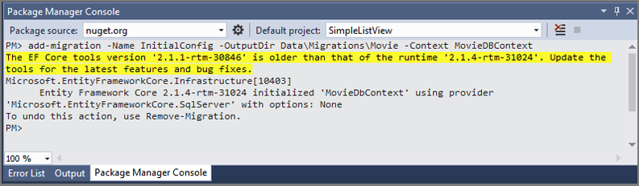

# ASP.NET Core-2.1 : Simple List View with Pagination
This project is to demonstrate how to create a simple list view with ASP.NET Core 2.1. 
This project will cover creating view controller and views, using multiple model in a single view, 
implementing simple pagination with purely ASP.NET Core 2.1.


#### Output of the Project

##### Movie List View Page


#### Project Overview 
This Project will cover the followings
- Changing the bootstrap theme from bootswatch website.
- Removing the uncessary views and controller actions.
- Removing the unnecessary tags from _Layout.cshtml and index.cshtml files.
- Creating Models for Movie Table and Pagination.
- Creating Custom DBContext and Data Seeding Function using Base64 JSON string.
- Creating Database using Package Manager Console(Power Shell) or Command Prompt.
- Changing Route Map.
- Pagination using pagination model and home controller.
- Handling multiple models with single view.

#### Creating New project
In Visual studio 2017, create new ASP.NET 2.1 Core solution and select "Web Application (Model-View-Controller)" project with "No Authentication".


The new solution will created with following folders and files.


#### Preparation for Project

##### Changing Bootstrap Theme to Lumen
- Browse the bootswatch version 3 page https://bootswatch.com/3/. _(note:default is version 4 and not compatible with asp.net core 2.1)_
- Select the Lumen theme and download _**bootstrap.min.css**_.
- Rename the Lumen theme css file to _**bootstrap-lumen.min.css**_ and 
- copy to _**wwwroot\lib\bootstrap\dist**_ folder.


- Open _**Views\Shared\_Layout.cshtml**_ file and replace link tag of _**bootstarp.css**_ style 
sheet with _**bootstrap-lumen.min.css**_ for both _**Development**_ and _**Staging/Production**_ environment.

##### Adding Section Renderer for page specific CSS and Javascript
At the end of the _**&lt;head&gt;**_ tag in _**_Layout.cshtml**_ file, add _**page_css**_ section renderer to allow rendering of page specific css files.

At the end of the _**&lt;body&gt;**_ tag in _**_Layout.cshtml**_ file, add *page_script* section renderer to allow rendering of page specific script files.

In both section renderer, required parameter is false as this section is not mandatory and it will render only for the page those has special behaviour.

```HTML
<!DOCTYPE html>
<html>

<head>
	...

	@RenderSection("page_css", required:false)
</head>

<body>
	...

	@RenderSection("page_script", required: false)
</body>

</html>
```

##### Removing Unnecessary Controller Actions and Views
- Delete _**About.cshtml, Contact.cshtml, Privacy.cshtml**_ views from _**Views**_ folder.
- In HomeController, _**Controller\HomeController.cs**_, file, delete _**About, Contact**_ and 
_**Pravicy*_ actions.
- In _**Views\Shared\_Layout.cshtml**_ file delete the menu section _**&lt;ul&gt;**_ tag inside _**&lt;nav&gt;**_ tag
that render the menu items.
- In _**Views\Home\Index.cshtml**_ file delete both _**&lt;div&gt;**_ and leave only viewdata assigning part.  `@{ViewData["Title"] = "Home Page";}`

#### Creating the Models

Create _**Movie.cs**_ file in _**Models**_ Folder and declare the fields that require for movie related information.

```C#
using System;
using System.Collections.Generic;
using System.ComponentModel.DataAnnotations;
using System.Linq;
using System.Threading.Tasks;

namespace SimpleListView.Models
{
    public class Movie
    {
        [Key]
        [MaxLength(10)]
        public String MovieID       { get; set; }
        [MaxLength(200)]
        public string Title         { get; set; }
        [MaxLength(100)]
        public string Genre         { get; set; }
        public int Year             { get; set; }
        public int Duration         { get; set; }
        [MaxLength(50)]
        public string Category      { get; set; }
        [MaxLength(100)]
        public string Director      { get; set; }
        [MaxLength(200)]
        public string Cast          { get; set; }
        [MaxLength(4000)]
        public string BriefStory    { get; set; }
    }
}
```

Create _**Pagination.cs**_ file in _**Models**_ Folder and declare the fields that require for pagination.

```C#
using System;
using System.Collections.Generic;
using System.Linq;
using System.Threading.Tasks;

namespace SimpleListView.Models
{
    public class Pagination
    {
        public int PageNo               { get; set; } = 1;  // Assign Default PageNo to 1.
        public int PageSize             { get; set; } = 6;  // Assign Default PageSize to 6.
        public int TotalCount           { get; set; }
        public int PageButtonCount      { get; set; } = 10; // Assign Display PageButtonCount to 10;

        public int TotalPages => (int)Math.Ceiling(decimal.Divide(TotalCount, PageSize));
    }
}
```

#### Create MovieDBContext And Data Seeding Function

Create a new folder named _**Data**_ and add new code file named _**MovieDBContext.cs**_ file under _**Data**_ folder.

```C#
using Microsoft.EntityFrameworkCore;
using Newtonsoft.Json;
using SimpleListView.Models;
using System;
using System.Collections.Generic;
using System.Linq;
using System.Text;
using System.Threading.Tasks;

namespace SimpleListView.Data
{
    public class MovieDbContext : DbContext
    {
        public MovieDbContext(DbContextOptions<MovieDbContext> options) : base(options) { }

        public DbSet<Movie> Movies { get; set; }

        protected override void OnModelCreating(ModelBuilder modelBuilder)
        {
            String movieListBase64JSON = "ICAgICBbewogICAgIAkJIk1vdmllSUQiOiAiTTE3LTAwMSIsCiAgICAgCQkiVGl0bGUiOiAiSnVzdGljZSBMZWFndWUiLAogICAgIAkJIkdlbnJlIjogIkFjdGlvbiwgQWR2ZW50dXJlLCBGYW50YXN5IiwKICAgICAJCSJZZWFyIjogIjIwMTciLAogICAgIAkJIkR1cmF0aW9uIjogIjEyMCIsCiAgICAgCQkiQ2F0ZWdvcnkiOiAiUEctMTMiLAogICAgIAkJIkRpcmVjdG9yIjogIlphY2sgU255ZGVyIiwKICAgICAJCSJDYXN0IjogIkJlbiBBZmZsZWNrLCBHYWwgR2Fkb3QsIEphc29uIE1vbW9hLCBFenJhIE1pbGxlciIsCiAgICAgCQkiQnJpZWZTdG9yeSI6ICJGdWVsZWQgYnkgaGlzIHJlc3RvcmVkIGZhaXRoIGluIGh1bWFuaXR5IGFuZCBpbnNwaXJlZCBieSBTdXBlcm1hbidzIHNlbGZsZXNzIGFjdCwgQnJ1Y2UgV2F5bmUgZW5saXN0cyB0aGUgaGVscCBvZiBoaXMgbmV3LWZvdW5kIGFsbHksIERpYW5hIFByaW5jZSwgdG8gZmFjZSBhbiBldmVuIGdyZWF0ZXIgZW5lbXkuIgogICAgIAl9LAogICAgIAl7CiAgICAgCQkiTW92aWVJRCI6ICJNMTctMDAyIiwKICAgICAJCSJUaXRsZSI6ICJUaG9yOiBSYWduYXJvayAiLAogICAgIAkJIkdlbnJlIjogIkFjdGlvbiwgQWR2ZW50dXJlLCBDb21lZHkiLAogICAgIAkJIlllYXIiOiAiMjAxNyIsCiAgICAgCQkiRHVyYXRpb24iOiAiMTMwIiwKICAgICAJCSJDYXRlZ29yeSI6ICJQRy0xMyIsCiAgICAgCQkiRGlyZWN0b3IiOiAiVGFpa2EgV2FpdGl0aSIsCiAgICAgCQkiQ2FzdCI6ICJDaHJpcyBIZW1zd29ydGgsIFRvbSBIaWRkbGVzdG9uLCBDYXRlIEJsYW5jaGV0dCwgTWFyayBSdWZmYWxvIiwKICAgICAJCSJCcmllZlN0b3J5IjogIlRob3IgaXMgaW1wcmlzb25lZCBvbiB0aGUgcGxhbmV0IFNha2FhciwgYW5kIG11c3QgcmFjZSBhZ2FpbnN0IHRpbWUgdG8gcmV0dXJuIHRvIEFzZ2FyZCBhbmQgc3RvcCBSYWduYXLDtmssIHRoZSBkZXN0cnVjdGlvbiBvZiBoaXMgd29ybGQsIGF0IHRoZSBoYW5kcyBvZiB0aGUgcG93ZXJmdWwgYW5kIHJ1dGhsZXNzIHZpbGxhaW4gSGVsYS4iCiAgICAgCX0sCiAgICAgCXsKICAgICAJCSJNb3ZpZUlEIjogIk0xNy0wMDMiLAogICAgIAkJIlRpdGxlIjogIkJheXdhdGNoIiwKICAgICAJCSJHZW5yZSI6ICJBY3Rpb24sIENvbWVkeSwgQ3JpbWUiLAogICAgIAkJIlllYXIiOiAiMjAxNyIsCiAgICAgCQkiRHVyYXRpb24iOiAiMTE2IiwKICAgICAJCSJDYXRlZ29yeSI6ICJSIiwKICAgICAJCSJEaXJlY3RvciI6ICJTZXRoIEdvcmRvbiIsCiAgICAgCQkiQ2FzdCI6ICJEd2F5bmUgSm9obnNvbiwgWmFjIEVmcm9uLCBBbGV4YW5kcmEgRGFkZGFyaW8sIFByaXlhbmthIENob3ByYSIsCiAgICAgCQkiQnJpZWZTdG9yeSI6ICJEZXZvdGVkIGxpZmVndWFyZCBNaXRjaCBCdWNoYW5ub24gYnV0dHMgaGVhZHMgd2l0aCBhIGJyYXNoIG5ldyByZWNydWl0LCBhcyB0aGV5IHVuY292ZXIgYSBjcmltaW5hbCBwbG90IHRoYXQgdGhyZWF0ZW5zIHRoZSBmdXR1cmUgb2YgdGhlIGJheS4iCiAgICAgCX0sCiAgICAgCXsKICAgICAJCSJNb3ZpZUlEIjogIk0xNy0wMDQiLAogICAgIAkJIlRpdGxlIjogIlNwaWRlci1NYW46IEhvbWVjb21pbmciLAogICAgIAkJIkdlbnJlIjogIkFjdGlvbiwgQWR2ZW50dXJlLCBTY2ktRmkiLAogICAgIAkJIlllYXIiOiAiMjAxNyIsCiAgICAgCQkiRHVyYXRpb24iOiAiMTMzIiwKICAgICAJCSJDYXRlZ29yeSI6ICJQRy0xMyIsCiAgICAgCQkiRGlyZWN0b3IiOiAiSm9uIFdhdHRzIiwKICAgICAJCSJDYXN0IjogIlRvbSBIb2xsYW5kLCBNaWNoYWVsIEtlYXRvbiwgUm9iZXJ0IERvd25leSBKci4sIE1hcmlzYSBUb21laSIsCiAgICAgCQkiQnJpZWZTdG9yeSI6ICJQZXRlciBQYXJrZXIgYmFsYW5jZXMgaGlzIGxpZmUgYXMgYW4gb3JkaW5hcnkgaGlnaCBzY2hvb2wgc3R1ZGVudCBpbiBRdWVlbnMgd2l0aCBoaXMgc3VwZXJoZXJvIGFsdGVyLWVnbyBTcGlkZXItTWFuLCBhbmQgZmluZHMgaGltc2VsZiBvbiB0aGUgdHJhaWwgb2YgYSBuZXcgbWVuYWNlIHByb3dsaW5nIHRoZSBza2llcyBvZiBOZXcgWW9yayBDaXR5LiIKICAgICAJfSwKICAgICAJewogICAgIAkJIk1vdmllSUQiOiAiTTE3LTAwNSIsCiAgICAgCQkiVGl0bGUiOiAiV29uZGVyIFdvbWFuIiwKICAgICAJCSJHZW5yZSI6ICJBY3Rpb24sIEFkdmVudHVyZSwgRmFudGFzeSIsCiAgICAgCQkiWWVhciI6ICIyMDE3IiwKICAgICAJCSJEdXJhdGlvbiI6ICIxNDEiLAogICAgIAkJIkNhdGVnb3J5IjogIlBHLTEzIiwKICAgICAJCSJEaXJlY3RvciI6ICJQYXR0eSBKZW5raW5zIiwKICAgICAJCSJDYXN0IjogIkdhbCBHYWRvdCwgQ2hyaXMgUGluZSwgUm9iaW4gV3JpZ2h0LCBMdWN5IERhdmlzIiwKICAgICAJCSJCcmllZlN0b3J5IjogIldoZW4gYSBwaWxvdCBjcmFzaGVzIGFuZCB0ZWxscyBvZiBjb25mbGljdCBpbiB0aGUgb3V0c2lkZSB3b3JsZCwgRGlhbmEsIGFuIEFtYXpvbmlhbiB3YXJyaW9yIGluIHRyYWluaW5nLCBsZWF2ZXMgaG9tZSB0byBmaWdodCBhIHdhciwgZGlzY292ZXJpbmcgaGVyIGZ1bGwgcG93ZXJzIGFuZCB0cnVlIGRlc3RpbnkuIgogICAgIAl9LAogICAgIAl7CiAgICAgCQkiTW92aWVJRCI6ICJNMTctMDA2IiwKICAgICAJCSJUaXRsZSI6ICJTdGFyIFdhcnM6IEVwaXNvZGUgVklJSSAtIFRoZSBMYXN0IEplZGkiLAogICAgIAkJIkdlbnJlIjogIkFjdGlvbiwgQWR2ZW50dXJlLCBGYW50YXN5IiwKICAgICAJCSJZZWFyIjogIjIwMTciLAogICAgIAkJIkR1cmF0aW9uIjogIjE1MiIsCiAgICAgCQkiQ2F0ZWdvcnkiOiAiUEctMTMiLAogICAgIAkJIkRpcmVjdG9yIjogIlJpYW4gSm9obnNvbiIsCiAgICAgCQkiQ2FzdCI6ICJEYWlzeSBSaWRsZXksIEpvaG4gQm95ZWdhLCBNYXJrIEhhbWlsbCwgQ2FycmllIEZpc2hlciIsCiAgICAgCQkiQnJpZWZTdG9yeSI6ICJSZXkgZGV2ZWxvcHMgaGVyIG5ld2x5IGRpc2NvdmVyZWQgYWJpbGl0aWVzIHdpdGggdGhlIGd1aWRhbmNlIG9mIEx1a2UgU2t5d2Fsa2VyLCB3aG8gaXMgdW5zZXR0bGVkIGJ5IHRoZSBzdHJlbmd0aCBvZiBoZXIgcG93ZXJzLiBNZWFud2hpbGUsIHRoZSBSZXNpc3RhbmNlIHByZXBhcmVzIGZvciBiYXR0bGUgd2l0aCB0aGUgRmlyc3QgT3JkZXIuIgogICAgIAl9LAogICAgIAl7CiAgICAgCQkiTW92aWVJRCI6ICJNMTctMDA3IiwKICAgICAJCSJUaXRsZSI6ICJHdWFyZGlhbnMgb2YgdGhlIEdhbGF4eSBWb2wuIDIiLAogICAgIAkJIkdlbnJlIjogIkFjdGlvbiwgQWR2ZW50dXJlLCBDb21lZHkiLAogICAgIAkJIlllYXIiOiAiMjAxNyIsCiAgICAgCQkiRHVyYXRpb24iOiAiMTM2IiwKICAgICAJCSJDYXRlZ29yeSI6ICJQRy0xMyIsCiAgICAgCQkiRGlyZWN0b3IiOiAiSmFtZXMgR3VubiIsCiAgICAgCQkiQ2FzdCI6ICJDaHJpcyBQcmF0dCwgWm9lIFNhbGRhbmEsIERhdmUgQmF1dGlzdGEsIFZpbiBEaWVzZWwiLAogICAgIAkJIkJyaWVmU3RvcnkiOiAiVGhlIEd1YXJkaWFucyBzdHJ1Z2dsZSB0byBrZWVwIHRvZ2V0aGVyIGFzIGEgdGVhbSB3aGlsZSBkZWFsaW5nIHdpdGggdGhlaXIgcGVyc29uYWwgZmFtaWx5IGlzc3Vlcywgbm90YWJseSBTdGFyLUxvcmQncyBlbmNvdW50ZXIgd2l0aCBoaXMgZmF0aGVyIHRoZSBhbWJpdGlvdXMgY2VsZXN0aWFsIGJlaW5nIEVnby4iCiAgICAgCX0sCiAgICAgCXsKICAgICAJCSJNb3ZpZUlEIjogIk0xNy0wMDgiLAogICAgIAkJIlRpdGxlIjogInhYeDogUmV0dXJuIG9mIFhhbmRlciBDYWdlIiwKICAgICAJCSJHZW5yZSI6ICJBY3Rpb24sIEFkdmVudHVyZSwgVGhyaWxsZXIiLAogICAgIAkJIlllYXIiOiAiMjAxNyIsCiAgICAgCQkiRHVyYXRpb24iOiAiMTA3IiwKICAgICAJCSJDYXRlZ29yeSI6ICJQRy0xMyIsCiAgICAgCQkiRGlyZWN0b3IiOiAiRC5KLiBDYXJ1c28iLAogICAgIAkJIkNhc3QiOiAiVmluIERpZXNlbCwgRG9ubmllIFllbiwgRGVlcGlrYSBQYWR1a29uZSwgS3JpcyBXdSIsCiAgICAgCQkiQnJpZWZTdG9yeSI6ICJYYW5kZXIgQ2FnZSBpcyBsZWZ0IGZvciBkZWFkIGFmdGVyIGFuIGluY2lkZW50LCB0aG91Z2ggaGUgc2VjcmV0bHkgcmV0dXJucyB0byBhY3Rpb24gZm9yIGEgbmV3LCB0b3VnaCBhc3NpZ25tZW50IHdpdGggaGlzIGhhbmRsZXIgQXVndXN0dXMgR2liYm9ucy4iCiAgICAgCX0sCiAgICAgCXsKICAgICAJCSJNb3ZpZUlEIjogIk0xNy0wMDkiLAogICAgIAkJIlRpdGxlIjogIkJlYXV0eSBhbmQgdGhlIEJlYXN0ICIsCiAgICAgCQkiR2VucmUiOiAiRmFtaWx5LCBGYW50YXN5LCBNdXNpY2FsIiwKICAgICAJCSJZZWFyIjogIjIwMTciLAogICAgIAkJIkR1cmF0aW9uIjogIjEyOSIsCiAgICAgCQkiQ2F0ZWdvcnkiOiAiUEciLAogICAgIAkJIkRpcmVjdG9yIjogIkJpbGwgQ29uZG9uIiwKICAgICAJCSJDYXN0IjogIkVtbWEgV2F0c29uLCBEYW4gU3RldmVucywgTHVrZSBFdmFucywgSm9zaCBHYWQiLAogICAgIAkJIkJyaWVmU3RvcnkiOiAiQSBzZWxmaXNoIHByaW5jZSBpcyBjdXJzZWQgdG8gYmVjb21lIGEgbW9uc3RlciBmb3IgdGhlIHJlc3Qgb2YgaGlzIGxpZmUsIHVubGVzcyBoZSBsZWFybnMgdG8gZmFsbCBpbiBsb3ZlIHdpdGggYSBiZWF1dGlmdWwgeW91bmcgd29tYW4gaGUga2VlcHMgcHJpc29uZXIuIgogICAgIAl9LAogICAgIAl7CiAgICAgCQkiTW92aWVJRCI6ICJNMTctMDEwIiwKICAgICAJCSJUaXRsZSI6ICJDb2NvIiwKICAgICAJCSJHZW5yZSI6ICJBbmltYXRpb24sIEFkdmVudHVyZSwgQ29tZWR5IiwKICAgICAJCSJZZWFyIjogIjIwMTciLAogICAgIAkJIkR1cmF0aW9uIjogIjEwNSIsCiAgICAgCQkiQ2F0ZWdvcnkiOiAiUEciLAogICAgIAkJIkRpcmVjdG9yIjogIkxlZSBVbmtyaWNoLCBBZHJpYW4gTW9saW5hIiwKICAgICAJCSJDYXN0IjogIkFudGhvbnkgR29uemFsZXosIEdhZWwgR2FyY8OtYSBCZXJuYWwsIEJlbmphbWluIEJyYXR0LCBBbGFubmEgVWJhY2giLAogICAgIAkJIkJyaWVmU3RvcnkiOiAiQXNwaXJpbmcgbXVzaWNpYW4gTWlndWVsLCBjb25mcm9udGVkIHdpdGggaGlzIGZhbWlseSdzIGFuY2VzdHJhbCBiYW4gb24gbXVzaWMsIGVudGVycyB0aGUgTGFuZCBvZiB0aGUgRGVhZCB0byBmaW5kIGhpcyBncmVhdC1ncmVhdC1ncmFuZGZhdGhlciwgYSBsZWdlbmRhcnkgc2luZ2VyLiIKICAgICAJfSwKICAgICAJewogICAgIAkJIk1vdmllSUQiOiAiTTE3LTAxMSIsCiAgICAgCQkiVGl0bGUiOiAiVGhlIEZhdGUgb2YgdGhlIEZ1cmlvdXMiLAogICAgIAkJIkdlbnJlIjogIkFjdGlvbiwgQ3JpbWUsIFRocmlsbGVyIiwKICAgICAJCSJZZWFyIjogIjIwMTciLAogICAgIAkJIkR1cmF0aW9uIjogIjEzNiIsCiAgICAgCQkiQ2F0ZWdvcnkiOiAiUEctMTMiLAogICAgIAkJIkRpcmVjdG9yIjogIkYuIEdhcnkgR3JheSIsCiAgICAgCQkiQ2FzdCI6ICJWaW4gRGllc2VsLCBKYXNvbiBTdGF0aGFtLCBEd2F5bmUgSm9obnNvbiwgTWljaGVsbGUgUm9kcmlndWV6IiwKICAgICAJCSJCcmllZlN0b3J5IjogIldoZW4gYSBteXN0ZXJpb3VzIHdvbWFuIHNlZHVjZXMgRG9tIGludG8gdGhlIHdvcmxkIG9mIHRlcnJvcmlzbSBhbmQgYSBiZXRyYXlhbCBvZiB0aG9zZSBjbG9zZXN0IHRvIGhpbSwgdGhlIGNyZXcgZmFjZSB0cmlhbHMgdGhhdCB3aWxsIHRlc3QgdGhlbSBhcyBuZXZlciBiZWZvcmUuIgogICAgIAl9LAogICAgIAl7CiAgICAgCQkiTW92aWVJRCI6ICJNMTctMDEyIiwKICAgICAJCSJUaXRsZSI6ICJMaWZlIiwKICAgICAJCSJHZW5yZSI6ICJIb3Jyb3IsIFNjaS1GaSwgVGhyaWxsZXIiLAogICAgIAkJIlllYXIiOiAiMjAxNyIsCiAgICAgCQkiRHVyYXRpb24iOiAiMTA0IiwKICAgICAJCSJDYXRlZ29yeSI6ICJSIiwKICAgICAJCSJEaXJlY3RvciI6ICJEYW5pZWwgRXNwaW5vc2EiLAogICAgIAkJIkNhc3QiOiAiSmFrZSBHeWxsZW5oYWFsLCBSZWJlY2NhIEZlcmd1c29uLCBSeWFuIFJleW5vbGRzLCBIaXJveXVraSBTYW5hZGEiLAogICAgIAkJIkJyaWVmU3RvcnkiOiAiQSB0ZWFtIG9mIHNjaWVudGlzdHMgYWJvYXJkIHRoZSBJbnRlcm5hdGlvbmFsIFNwYWNlIFN0YXRpb24gZGlzY292ZXIgYSByYXBpZGx5IGV2b2x2aW5nIGxpZmUgZm9ybSB0aGF0IGNhdXNlZCBleHRpbmN0aW9uIG9uIE1hcnMgYW5kIG5vdyB0aHJlYXRlbnMgYWxsIGxpZmUgb24gRWFydGguIgogICAgIAl9LAogICAgIAl7CiAgICAgCQkiTW92aWVJRCI6ICJNMTctMDEzIiwKICAgICAJCSJUaXRsZSI6ICJQaXJhdGVzIG9mIHRoZSBDYXJpYmJlYW46IERlYWQgTWVuIFRlbGwgTm8gVGFsZXMiLAogICAgIAkJIkdlbnJlIjogIkFjdGlvbiwgQWR2ZW50dXJlLCBGYW50YXN5IiwKICAgICAJCSJZZWFyIjogIjIwMTciLAogICAgIAkJIkR1cmF0aW9uIjogIjEyOSIsCiAgICAgCQkiQ2F0ZWdvcnkiOiAiUEctMTMiLAogICAgIAkJIkRpcmVjdG9yIjogIkpvYWNoaW0gUsO4bm5pbmcsIEVzcGVuIFNhbmRiZXJnIiwKICAgICAJCSJDYXN0IjogIkpvaG5ueSBEZXBwLCBHZW9mZnJleSBSdXNoLCBKYXZpZXIgQmFyZGVtLCBPcmxhbmRvIEJsb29tIiwKICAgICAJCSJCcmllZlN0b3J5IjogIkNhcHRhaW4gSmFjayBTcGFycm93IHNlYXJjaGVzIGZvciB0aGUgdHJpZGVudCBvZiBQb3NlaWRvbiB3aGlsZSBiZWluZyBwdXJzdWVkIGJ5IGFuIHVuZGVhZCBzZWEgY2FwdGFpbiBhbmQgaGlzIGNyZXcuIgogICAgIAl9LAogICAgIAl7CiAgICAgCQkiTW92aWVJRCI6ICJNMTctMDE0IiwKICAgICAJCSJUaXRsZSI6ICJUaGUgTXVtbXkiLAogICAgIAkJIkdlbnJlIjogIkFjdGlvbiwgQWR2ZW50dXJlLCBGYW50YXN5IiwKICAgICAJCSJZZWFyIjogIjIwMTciLAogICAgIAkJIkR1cmF0aW9uIjogIjExMCIsCiAgICAgCQkiQ2F0ZWdvcnkiOiAiUEctMTMiLAogICAgIAkJIkRpcmVjdG9yIjogIkFsZXggS3VydHptYW4iLAogICAgIAkJIkNhc3QiOiAiVG9tIENydWlzZSwgU29maWEgQm91dGVsbGEsIEFubmFiZWxsZSBXYWxsaXMsIFJ1c3NlbGwgQ3Jvd2UiLAogICAgIAkJIkJyaWVmU3RvcnkiOiAiQW4gYW5jaWVudCBFZ3lwdGlhbiBwcmluY2VzcyBpcyBhd2FrZW5lZCBmcm9tIGhlciBjcnlwdCBiZW5lYXRoIHRoZSBkZXNlcnQsIGJyaW5naW5nIHdpdGggaGVyIG1hbGV2b2xlbmNlIGdyb3duIG92ZXIgbWlsbGVubmlhLCBhbmQgdGVycm9ycyB0aGF0IGRlZnkgaHVtYW4gY29tcHJlaGVuc2lvbi4iCiAgICAgCX0sCiAgICAgCXsKICAgICAJCSJNb3ZpZUlEIjogIk0xNy0wMTUiLAogICAgIAkJIlRpdGxlIjogIlRyYW5zZm9ybWVyczogVGhlIExhc3QgS25pZ2h0IiwKICAgICAJCSJHZW5yZSI6ICJBY3Rpb24sIEFkdmVudHVyZSwgU2NpLUZpIiwKICAgICAJCSJZZWFyIjogIjIwMTciLAogICAgIAkJIkR1cmF0aW9uIjogIjE1NCIsCiAgICAgCQkiQ2F0ZWdvcnkiOiAiUEctMTMiLAogICAgIAkJIkRpcmVjdG9yIjogIk1pY2hhZWwgQmF5IiwKICAgICAJCSJDYXN0IjogIk1hcmsgV2FobGJlcmcsIEFudGhvbnkgSG9wa2lucywgSm9zaCBEdWhhbWVsLCBMYXVyYSBIYWRkb2NrIiwKICAgICAJCSJCcmllZlN0b3J5IjogIkEgZGVhZGx5IHRocmVhdCBmcm9tIEVhcnRoJ3MgaGlzdG9yeSByZWFwcGVhcnMsIGFuZCBhIGh1bnQgZm9yIGEgbG9zdCBhcnRpZmFjdCB0YWtlcyBwbGFjZSBiZXR3ZWVuIEF1dG9ib3RzIGFuZCBEZWNlcHRpY29ucywgd2hpbGUgT3B0aW11cyBQcmltZSBlbmNvdW50ZXJzIGhpcyBjcmVhdG9yIGluIHNwYWNlLiIKICAgICAJfSwKICAgICAJewogICAgIAkJIk1vdmllSUQiOiAiTTE3LTAxNiIsCiAgICAgCQkiVGl0bGUiOiAiR2Vvc3Rvcm0iLAogICAgIAkJIkdlbnJlIjogIkFjdGlvbiwgU2NpLUZpLCBUaHJpbGxlciIsCiAgICAgCQkiWWVhciI6ICIyMDE3IiwKICAgICAJCSJEdXJhdGlvbiI6ICIxMDkiLAogICAgIAkJIkNhdGVnb3J5IjogIlBHLTEzIiwKICAgICAJCSJEaXJlY3RvciI6ICIgRGVhbiBEZXZsaW4iLAogICAgIAkJIkNhc3QiOiAiR2VyYXJkIEJ1dGxlciwgSmltIFN0dXJnZXNzLCBBYmJpZSBDb3JuaXNoLCBBbGV4YW5kcmEgTWFyaWEgTGFyYSIsCiAgICAgCQkiQnJpZWZTdG9yeSI6ICJXaGVuIHRoZSBuZXR3b3JrIG9mIHNhdGVsbGl0ZXMgZGVzaWduZWQgdG8gY29udHJvbCB0aGUgZ2xvYmFsIGNsaW1hdGUgc3RhcnRzIHRvIGF0dGFjayBFYXJ0aCwgaXQncyBhIHJhY2UgYWdhaW5zdCB0aGUgY2xvY2sgZm9yIGl0cyBjcmVhdG9yIHRvIHVuY292ZXIgdGhlIHJlYWwgdGhyZWF0IGJlZm9yZSBhIHdvcmxkd2lkZSBHZW9zdG9ybSB3aXBlcyBvdXQgZXZlcnl0aGluZyBhbmQgZXZlcnlvbmUuIgogICAgIAl9LAogICAgIAl7CiAgICAgCQkiTW92aWVJRCI6ICJNMTctMDE3IiwKICAgICAJCSJUaXRsZSI6ICJGaWZ0eSBTaGFkZXMgRGFya2VyICIsCiAgICAgCQkiR2VucmUiOiAiRHJhbWEsIFJvbWFuY2UiLAogICAgIAkJIlllYXIiOiAiMjAxNyIsCiAgICAgCQkiRHVyYXRpb24iOiAiMTE4IiwKICAgICAJCSJDYXRlZ29yeSI6ICJSIiwKICAgICAJCSJEaXJlY3RvciI6ICJKYW1lcyBGb2xleSIsCiAgICAgCQkiQ2FzdCI6ICJEYWtvdGEgSm9obnNvbiwgSmFtaWUgRG9ybmFuLCBFcmljIEpvaG5zb24sIEVsb2lzZSBNdW1mb3JkIiwKICAgICAJCSJCcmllZlN0b3J5IjogIldoaWxlIENocmlzdGlhbiB3cmVzdGxlcyB3aXRoIGhpcyBpbm5lciBkZW1vbnMsIEFuYXN0YXNpYSBtdXN0IGNvbmZyb250IHRoZSBhbmdlciBhbmQgZW52eSBvZiB0aGUgd29tZW4gd2hvIGNhbWUgYmVmb3JlIGhlci4iCiAgICAgCX0sCiAgICAgCXsKICAgICAJCSJNb3ZpZUlEIjogIk0xNy0wMTgiLAogICAgIAkJIlRpdGxlIjogIkJyaWdodCIsCiAgICAgCQkiR2VucmUiOiAiQWN0aW9uLCBDcmltZSwgRmFudGFzeSIsCiAgICAgCQkiWWVhciI6ICIyMDE3IiwKICAgICAJCSJEdXJhdGlvbiI6ICIxMTciLAogICAgIAkJIkNhdGVnb3J5IjogIlRWLU1BIiwKICAgICAJCSJEaXJlY3RvciI6ICJEYXZpZCBBeWVyIiwKICAgICAJCSJDYXN0IjogIldpbGwgU21pdGgsIEpvZWwgRWRnZXJ0b24sIE5vb21pIFJhcGFjZSwgRWRnYXIgUmFtw61yZXoiLAogICAgIAkJIkJyaWVmU3RvcnkiOiAiQSBkZXRlY3RpdmUgbXVzdCB3b3JrIHdpdGggYW4gT3JjIHRvIGZpbmQgYSBwb3dlcmZ1bCB3YW5kIGJlZm9yZSBldmlsIGNyZWF0dXJlcyBkby4iCiAgICAgCX0sCiAgICAgCXsKICAgICAJCSJNb3ZpZUlEIjogIk0xNy0wMTkiLAogICAgIAkJIlRpdGxlIjogIlRoZSBEYXJrIFRvd2VyIiwKICAgICAJCSJHZW5yZSI6ICJBY3Rpb24sIEFkdmVudHVyZSwgRmFudGFzeSIsCiAgICAgCQkiWWVhciI6ICIyMDE3IiwKICAgICAJCSJEdXJhdGlvbiI6ICI5NSIsCiAgICAgCQkiQ2F0ZWdvcnkiOiAiUEctMTMiLAogICAgIAkJIkRpcmVjdG9yIjogIk5pa29sYWogQXJjZWwiLAogICAgIAkJIkNhc3QiOiAiSWRyaXMgRWxiYSwgTWF0dGhldyBNY0NvbmF1Z2hleSwgVG9tIFRheWxvciwgRGVubmlzIEhheXNiZXJ0IiwKICAgICAJCSJCcmllZlN0b3J5IjogIlRoZSBsYXN0IEd1bnNsaW5nZXI6IFJvbGFuZCBEZXNjaGFpbiwgaGFzIGJlZW4gbG9ja2VkIGluIGFuIGV0ZXJuYWwgYmF0dGxlIHdpdGggV2FsdGVyIE8nRGltLCBhbHNvIGtub3duIGFzIHRoZSBNYW4gaW4gQmxhY2ssIGFuZCBkZXRlcm1pbmVkIHRvIHByZXZlbnQgaGltIGZyb20gdG9wcGxpbmcgdGhlIERhcmsgVG93ZXIgdGhhdCBob2xkcyB0aGUgdW5pdmVyc2UgdG9nZXRoZXIuIFdpdGggdGhlIGZhdGUgb2YgdGhlIHdvcmxkIGF0IHN0YWtlLCBnb29kIGFuZCBldmlsIHdpbGwgY29sbGlkZSBpbiB0aGUgdWx0aW1hdGUgYmF0dGxlLCBhcyBvbmx5IFJvbGFuZCBjYW4gZGVmZW5kIHRoZSBUb3dlciBmcm9tIHRoZSBNYW4gaW4gQmxhY2suIgogICAgIAl9LAogICAgIAl7CiAgICAgCQkiTW92aWVJRCI6ICJNMTctMDIwIiwKICAgICAJCSJUaXRsZSI6ICJUaGUgRm9yZWlnbmVyIiwKICAgICAJCSJHZW5yZSI6ICJBY3Rpb24sIENyaW1lLCBEcmFtYSIsCiAgICAgCQkiWWVhciI6ICIyMDE3IiwKICAgICAJCSJEdXJhdGlvbiI6ICIxMTMiLAogICAgIAkJIkNhdGVnb3J5IjogIlIiLAogICAgIAkJIkRpcmVjdG9yIjogIk1hcnRpbiBDYW1wYmVsbCAiLAogICAgIAkJIkNhc3QiOiAiS2F0aWUgTGV1bmcsIEphY2tpZSBDaGFuLCBSdWZ1cyBKb25lcywgTWFyayBUYW5keSIsCiAgICAgCQkiQnJpZWZTdG9yeSI6ICJBIGh1bWJsZSBidXNpbmVzc21hbiB3aXRoIGEgYnVyaWVkIHBhc3Qgc2Vla3MganVzdGljZSB3aGVuIGhpcyBkYXVnaHRlciBpcyBraWxsZWQgaW4gYW4gYWN0IG9mIHRlcnJvcmlzbS4gQSBjYXQtYW5kLW1vdXNlIGNvbmZsaWN0IGVuc3VlcyB3aXRoIGEgZ292ZXJubWVudCBvZmZpY2lhbCwgd2hvc2UgcGFzdCBtYXkgaG9sZCBjbHVlcyB0byB0aGUga2lsbGVycycgaWRlbnRpdGllcy4iCiAgICAgCX0sCiAgICAgCXsKICAgICAJCSJNb3ZpZUlEIjogIk0xOC0wMDEiLAogICAgIAkJIlRpdGxlIjogIkFxdWFtYW4iLAogICAgIAkJIkdlbnJlIjogIkFjdGlvbiwgQWR2ZW50dXJlLCBGYW50YXN5IiwKICAgICAJCSJZZWFyIjogIjIwMTgiLAogICAgIAkJIkR1cmF0aW9uIjogIjE0MyIsCiAgICAgCQkiQ2F0ZWdvcnkiOiAiUEctMTMiLAogICAgIAkJIkRpcmVjdG9yIjogIkphbWVzIFdhbiIsCiAgICAgCQkiQ2FzdCI6ICJKYXNvbiBNb21vYSwgQW1iZXIgSGVhcmQsIFdpbGxlbSBEYWZvZSwgUGF0cmljayBXaWxzb24iLAogICAgIAkJIkJyaWVmU3RvcnkiOiAiQXJ0aHVyIEN1cnJ5LCB0aGUgaHVtYW4tYm9ybiBoZWlyIHRvIHRoZSB1bmRlcndhdGVyIGtpbmdkb20gb2YgQXRsYW50aXMsIGdvZXMgb24gYSBxdWVzdCB0byBwcmV2ZW50IGEgd2FyIGJldHdlZW4gdGhlIHdvcmxkcyBvZiBvY2VhbiBhbmQgbGFuZC4iCiAgICAgCX0sCiAgICAgCXsKICAgICAJCSJNb3ZpZUlEIjogIk0xOC0wMDIiLAogICAgIAkJIlRpdGxlIjogIlNwaWRlci1NYW46IEludG8gdGhlIFNwaWRlci1WZXJzZSIsCiAgICAgCQkiR2VucmUiOiAiQW5pbWF0aW9uLCBBY3Rpb24sIEFkdmVudHVyZSIsCiAgICAgCQkiWWVhciI6ICIyMDE4IiwKICAgICAJCSJEdXJhdGlvbiI6ICIxMTciLAogICAgIAkJIkNhdGVnb3J5IjogIlBHIiwKICAgICAJCSJEaXJlY3RvciI6ICJCb2IgUGVyc2ljaGV0dGksIFBldGVyIFJhbXNleSwgUm9kbmV5IFJvdGhtYW4iLAogICAgIAkJIkNhc3QiOiAiU2hhbWVpayBNb29yZSwgSmFrZSBKb2huc29uLCBIYWlsZWUgU3RlaW5mZWxkLCBNYWhlcnNoYWxhIEFsaSIsCiAgICAgCQkiQnJpZWZTdG9yeSI6ICJUZWVuIE1pbGVzIE1vcmFsZXMgYmVjb21lcyBTcGlkZXItTWFuIG9mIGhpcyByZWFsaXR5LCBjcm9zc2luZyBoaXMgcGF0aCB3aXRoIGZpdmUgY291bnRlcnBhcnRzIGZyb20gb3RoZXIgZGltZW5zaW9ucyB0byBzdG9wIGEgdGhyZWF0IGZvciBhbGwgcmVhbGl0aWVzLiIKICAgICAJfSwKICAgICAJewogICAgIAkJIk1vdmllSUQiOiAiTTE4LTAwMyIsCiAgICAgCQkiVGl0bGUiOiAiQmxhY2sgUGFudGhlciAiLAogICAgIAkJIkdlbnJlIjogIkFjdGlvbiwgQWR2ZW50dXJlLCBTY2ktRmkiLAogICAgIAkJIlllYXIiOiAiMjAxOCIsCiAgICAgCQkiRHVyYXRpb24iOiAiMTM0IiwKICAgICAJCSJDYXRlZ29yeSI6ICJQRy0xMyIsCiAgICAgCQkiRGlyZWN0b3IiOiAiUnlhbiBDb29nbGVyIiwKICAgICAJCSJDYXN0IjogIkNoYWR3aWNrIEJvc2VtYW4sIE1pY2hhZWwgQi4gSm9yZGFuLCBMdXBpdGEgTnlvbmcnbywgRGFuYWkgR3VyaXJhIiwKICAgICAJCSJCcmllZlN0b3J5IjogIlQnQ2hhbGxhLCBoZWlyIHRvIHRoZSBoaWRkZW4gYnV0IGFkdmFuY2VkIGtpbmdkb20gb2YgV2FrYW5kYSwgbXVzdCBzdGVwIGZvcndhcmQgdG8gbGVhZCBoaXMgcGVvcGxlIGludG8gYSBuZXcgZnV0dXJlIGFuZCBtdXN0IGNvbmZyb250IGEgY2hhbGxlbmdlciBmcm9tIGhpcyBjb3VudHJ5J3MgcGFzdC4iCiAgICAgCX0sCiAgICAgCXsKICAgICAJCSJNb3ZpZUlEIjogIk0xOC0wMDQiLAogICAgIAkJIlRpdGxlIjogIkF2ZW5nZXJzOiBJbmZpbml0eSBXYXIiLAogICAgIAkJIkdlbnJlIjogIkFjdGlvbiwgQWR2ZW50dXJlLCBGYW50YXN5IiwKICAgICAJCSJZZWFyIjogIjIwMTgiLAogICAgIAkJIkR1cmF0aW9uIjogIjE0OSIsCiAgICAgCQkiQ2F0ZWdvcnkiOiAiUEctMTMiLAogICAgIAkJIkRpcmVjdG9yIjogIkFudGhvbnkgUnVzc28sIEpvZSBSdXNzbyIsCiAgICAgCQkiQ2FzdCI6ICJSb2JlcnQgRG93bmV5IEpyLiwgQ2hyaXMgSGVtc3dvcnRoLCBNYXJrIFJ1ZmZhbG8sIENocmlzIEV2YW5zIiwKICAgICAJCSJCcmllZlN0b3J5IjogIlRoZSBBdmVuZ2VycyBhbmQgdGhlaXIgYWxsaWVzIG11c3QgYmUgd2lsbGluZyB0byBzYWNyaWZpY2UgYWxsIGluIGFuIGF0dGVtcHQgdG8gZGVmZWF0IHRoZSBwb3dlcmZ1bCBUaGFub3MgYmVmb3JlIGhpcyBibGl0eiBvZiBkZXZhc3RhdGlvbiBhbmQgcnVpbiBwdXRzIGFuIGVuZCB0byB0aGUgdW5pdmVyc2UuIgogICAgIAl9LAogICAgIAl7CiAgICAgCQkiTW92aWVJRCI6ICJNMTgtMDA1IiwKICAgICAJCSJUaXRsZSI6ICJPY2VhbidzIEVpZ2h0ICIsCiAgICAgCQkiR2VucmUiOiAiQWN0aW9uLCBDb21lZHksIENyaW1lIiwKICAgICAJCSJZZWFyIjogIjIwMTgiLAogICAgIAkJIkR1cmF0aW9uIjogIjExMCIsCiAgICAgCQkiQ2F0ZWdvcnkiOiAiUEctMTMiLAogICAgIAkJIkRpcmVjdG9yIjogIkdhcnkgUm9zcyIsCiAgICAgCQkiQ2FzdCI6ICJTYW5kcmEgQnVsbG9jaywgQ2F0ZSBCbGFuY2hldHQsIEFubmUgSGF0aGF3YXksIE1pbmR5IEthbGluZyIsCiAgICAgCQkiQnJpZWZTdG9yeSI6ICJEZWJiaWUgT2NlYW4gZ2F0aGVycyBhbiBhbGwtZmVtYWxlIGNyZXcgdG8gYXR0ZW1wdCBhbiBpbXBvc3NpYmxlIGhlaXN0IGF0IE5ldyBZb3JrIENpdHkncyB5ZWFybHkgTWV0IEdhbGEuIgogICAgIAl9LAogICAgIAl7CiAgICAgCQkiTW92aWVJRCI6ICJNMTgtMDA2IiwKICAgICAJCSJUaXRsZSI6ICJUaGUgUHJlZGF0b3IgIiwKICAgICAJCSJHZW5yZSI6ICJBY3Rpb24sIEFkdmVudHVyZSwgU2NpLUZpIiwKICAgICAJCSJZZWFyIjogIjIwMTgiLAogICAgIAkJIkR1cmF0aW9uIjogIjEwNyIsCiAgICAgCQkiQ2F0ZWdvcnkiOiAiUiIsCiAgICAgCQkiRGlyZWN0b3IiOiAiU2hhbmUgQmxhY2siLAogICAgIAkJIkNhc3QiOiAiQm95ZCBIb2xicm9vaywgVHJldmFudGUgUmhvZGVzLCBKYWNvYiBUcmVtYmxheSwgS2VlZ2FuLU1pY2hhZWwgS2V5IiwKICAgICAJCSJCcmllZlN0b3J5IjogIldoZW4gYSB5b3VuZyBib3kgYWNjaWRlbnRhbGx5IHRyaWdnZXJzIHRoZSB1bml2ZXJzZSdzIG1vc3QgbGV0aGFsIGh1bnRlcnMnIHJldHVybiB0byBFYXJ0aCwgb25seSBhIHJhZ3RhZyBjcmV3IG9mIGV4LXNvbGRpZXJzIGFuZCBhIGRpc2dydW50bGVkIHNjaWVudGlzdCBjYW4gcHJldmVudCB0aGUgZW5kIG9mIHRoZSBodW1hbiByYWNlLiIKICAgICAJfSwKICAgICAJewogICAgIAkJIk1vdmllSUQiOiAiTTE4LTAwNyIsCiAgICAgCQkiVGl0bGUiOiAiSnVyYXNzaWMgV29ybGQ6IEZhbGxlbiBLaW5nZG9tIiwKICAgICAJCSJHZW5yZSI6ICJBY3Rpb24sIEFkdmVudHVyZSwgU2NpLUZpIiwKICAgICAJCSJZZWFyIjogIjIwMTgiLAogICAgIAkJIkR1cmF0aW9uIjogIjEyOCIsCiAgICAgCQkiQ2F0ZWdvcnkiOiAiUEctMTMiLAogICAgIAkJIkRpcmVjdG9yIjogIkouQS4gQmF5b25hIiwKICAgICAJCSJDYXN0IjogIkNocmlzIFByYXR0LCBCcnljZSBEYWxsYXMgSG93YXJkLCBSYWZlIFNwYWxsLCBKdXN0aWNlIFNtaXRoIiwKICAgICAJCSJCcmllZlN0b3J5IjogIldoZW4gdGhlIGlzbGFuZCdzIGRvcm1hbnQgdm9sY2FubyBiZWdpbnMgcm9hcmluZyB0byBsaWZlLCBPd2VuIGFuZCBDbGFpcmUgbW91bnQgYSBjYW1wYWlnbiB0byByZXNjdWUgdGhlIHJlbWFpbmluZyBkaW5vc2F1cnMgZnJvbSB0aGlzIGV4dGluY3Rpb24tbGV2ZWwgZXZlbnQuIgogICAgIAl9LAogICAgIAl7CiAgICAgCQkiTW92aWVJRCI6ICJNMTgtMDA4IiwKICAgICAJCSJUaXRsZSI6ICJUb21iIFJhaWRlciIsCiAgICAgCQkiR2VucmUiOiAiQWN0aW9uLCBBZHZlbnR1cmUsIEZhbnRhc3kiLAogICAgIAkJIlllYXIiOiAiMjAxOCIsCiAgICAgCQkiRHVyYXRpb24iOiAiMTE5IiwKICAgICAJCSJDYXRlZ29yeSI6ICJQRy0xMyIsCiAgICAgCQkiRGlyZWN0b3IiOiAiUm9hciBVdGhhdWciLAogICAgIAkJIkNhc3QiOiAiQWxpY2lhIFZpa2FuZGVyLCBEb21pbmljIFdlc3QsIFdhbHRvbiBHb2dnaW5zLCBEYW5pZWwgV3UiLAogICAgIAkJIkJyaWVmU3RvcnkiOiAiTGFyYSBDcm9mdCwgdGhlIGZpZXJjZWx5IGluZGVwZW5kZW50IGRhdWdodGVyIG9mIGEgbWlzc2luZyBhZHZlbnR1cmVyLCBtdXN0IHB1c2ggaGVyc2VsZiBiZXlvbmQgaGVyIGxpbWl0cyB3aGVuIHNoZSBkaXNjb3ZlcnMgdGhlIGlzbGFuZCB3aGVyZSBoZXIgZmF0aGVyIGRpc2FwcGVhcmVkLiIKICAgICAJfSwKICAgICAJewogICAgIAkJIk1vdmllSUQiOiAiTTE4LTAwOSIsCiAgICAgCQkiVGl0bGUiOiAiRmlmdHkgU2hhZGVzIEZyZWVkIiwKICAgICAJCSJHZW5yZSI6ICJEcmFtYSwgUm9tYW5jZSwgVGhyaWxsZXIiLAogICAgIAkJIlllYXIiOiAiMjAxOCIsCiAgICAgCQkiRHVyYXRpb24iOiAiMTA1IiwKICAgICAJCSJDYXRlZ29yeSI6ICJSIiwKICAgICAJCSJEaXJlY3RvciI6ICJKYW1lcyBGb2xleSIsCiAgICAgCQkiQ2FzdCI6ICJEYWtvdGEgSm9obnNvbiwgSmFtaWUgRG9ybmFuLCBFcmljIEpvaG5zb24sIEVsb2lzZSBNdW1mb3JkIiwKICAgICAJCSJCcmllZlN0b3J5IjogIkFuYXN0YXNpYSBhbmQgQ2hyaXN0aWFuIGdldCBtYXJyaWVkLCBidXQgSmFjayBIeWRlIGNvbnRpbnVlcyB0byB0aHJlYXRlbiB0aGVpciByZWxhdGlvbnNoaXAuIgogICAgIAl9LAogICAgIAl7CiAgICAgCQkiTW92aWVJRCI6ICJNMTgtMDEwIiwKICAgICAJCSJUaXRsZSI6ICJUaGUgTnV0Y3JhY2tlciBhbmQgdGhlIEZvdXIgUmVhbG1zIiwKICAgICAJCSJHZW5yZSI6ICJBZHZlbnR1cmUsIEZhbWlseSwgRmFudGFzeSIsCiAgICAgCQkiWWVhciI6ICIyMDE4IiwKICAgICAJCSJEdXJhdGlvbiI6ICI5OSIsCiAgICAgCQkiQ2F0ZWdvcnkiOiAiUEciLAogICAgIAkJIkRpcmVjdG9yIjogIkxhc3NlIEhhbGxzdHLDtm0sIEpvZSBKb2huc3RvbiIsCiAgICAgCQkiQ2FzdCI6ICJNYWNrZW56aWUgRm95LCBLZWlyYSBLbmlnaHRsZXksIE1vcmdhbiBGcmVlbWFuLCBIZWxlbiBNaXJyZW4iLAogICAgIAkJIkJyaWVmU3RvcnkiOiAiQSB5b3VuZyBnaXJsIGlzIHRyYW5zcG9ydGVkIGludG8gYSBtYWdpY2FsIHdvcmxkIG9mIGdpbmdlcmJyZWFkIHNvbGRpZXJzIGFuZCBhbiBhcm15IG9mIG1pY2UuIgogICAgIAl9LAogICAgIAl7CiAgICAgCQkiTW92aWVJRCI6ICJNMTgtMDExIiwKICAgICAJCSJUaXRsZSI6ICJJbmNyZWRpYmxlcyAyIiwKICAgICAJCSJHZW5yZSI6ICJBbmltYXRpb24sIEFjdGlvbiwgQWR2ZW50dXJlIiwKICAgICAJCSJZZWFyIjogIjIwMTgiLAogICAgIAkJIkR1cmF0aW9uIjogIjExOCIsCiAgICAgCQkiQ2F0ZWdvcnkiOiAiUEciLAogICAgIAkJIkRpcmVjdG9yIjogIkJyYWQgQmlyZCIsCiAgICAgCQkiQ2FzdCI6ICJDcmFpZyBULiBOZWxzb24sIEhvbGx5IEh1bnRlciwgU2FyYWggVm93ZWxsLCBIdWNrIE1pbG5lciIsCiAgICAgCQkiQnJpZWZTdG9yeSI6ICJUaGUgSW5jcmVkaWJsZXMgaGVybyBmYW1pbHkgdGFrZXMgb24gYSBuZXcgbWlzc2lvbiwgd2hpY2ggaW52b2x2ZXMgYSBjaGFuZ2UgaW4gZmFtaWx5IHJvbGVzOiBCb2IgUGFyciAoTXIgSW5jcmVkaWJsZSkgbXVzdCBtYW5hZ2UgdGhlIGhvdXNlIHdoaWxlIGhpcyB3aWZlIEhlbGVuIChFbGFzdGlnaXJsKSBnb2VzIG91dCB0byBzYXZlIHRoZSB3b3JsZC4iCiAgICAgCX0sCiAgICAgCXsKICAgICAJCSJNb3ZpZUlEIjogIk0xOC0wMTIiLAogICAgIAkJIlRpdGxlIjogIk1pc3Npb246IEltcG9zc2libGUgLSBGYWxsb3V0IiwKICAgICAJCSJHZW5yZSI6ICJBY3Rpb24sIEFkdmVudHVyZSwgVGhyaWxsZXIiLAogICAgIAkJIlllYXIiOiAiMjAxOCIsCiAgICAgCQkiRHVyYXRpb24iOiAiMTQ3IiwKICAgICAJCSJDYXRlZ29yeSI6ICJQRy0xMyIsCiAgICAgCQkiRGlyZWN0b3IiOiAiQ2hyaXN0b3BoZXIgTWNRdWFycmllIiwKICAgICAJCSJDYXN0IjogIlRvbSBDcnVpc2UsIEhlbnJ5IENhdmlsbCwgVmluZyBSaGFtZXMsIFNpbW9uIFBlZ2ciLAogICAgIAkJIkJyaWVmU3RvcnkiOiAiRXRoYW4gSHVudCBhbmQgaGlzIElNRiB0ZWFtLCBhbG9uZyB3aXRoIHNvbWUgZmFtaWxpYXIgYWxsaWVzLCByYWNlIGFnYWluc3QgdGltZSBhZnRlciBhIG1pc3Npb24gZ29uZSB3cm9uZy4iCiAgICAgCX0sCiAgICAgCXsKICAgICAJCSJNb3ZpZUlEIjogIk0xOC0wMTMiLAogICAgIAkJIlRpdGxlIjogIlJhbXBhZ2UiLAogICAgIAkJIkdlbnJlIjogIkFjdGlvbiwgQWR2ZW50dXJlLCBTY2ktRmkiLAogICAgIAkJIlllYXIiOiAiMjAxOCIsCiAgICAgCQkiRHVyYXRpb24iOiAiMTA3IiwKICAgICAJCSJDYXRlZ29yeSI6ICJQRy0xMyIsCiAgICAgCQkiRGlyZWN0b3IiOiAiQnJhZCBQZXl0b24iLAogICAgIAkJIkNhc3QiOiAiRHdheW5lIEpvaG5zb24sIE5hb21pZSBIYXJyaXMsIE1hbGluIEFrZXJtYW4sIEplZmZyZXkgRGVhbiBNb3JnYW4iLAogICAgIAkJIkJyaWVmU3RvcnkiOiAiV2hlbiB0aHJlZSBkaWZmZXJlbnQgYW5pbWFscyBiZWNvbWUgaW5mZWN0ZWQgd2l0aCBhIGRhbmdlcm91cyBwYXRob2dlbiwgYSBwcmltYXRvbG9naXN0IGFuZCBhIGdlbmV0aWNpc3QgdGVhbSB1cCB0byBzdG9wIHRoZW0gZnJvbSBkZXN0cm95aW5nIENoaWNhZ28uIgogICAgIAl9LAogICAgIAl7CiAgICAgCQkiTW92aWVJRCI6ICJNMTgtMDE0IiwKICAgICAJCSJUaXRsZSI6ICJWZW5vbSIsCiAgICAgCQkiR2VucmUiOiAiQWN0aW9uLCBTY2ktRmkiLAogICAgIAkJIlllYXIiOiAiMjAxOCIsCiAgICAgCQkiRHVyYXRpb24iOiAiMTEyIiwKICAgICAJCSJDYXRlZ29yeSI6ICJQRy0xMyIsCiAgICAgCQkiRGlyZWN0b3IiOiAiUnViZW4gRmxlaXNjaGVyIiwKICAgICAJCSJDYXN0IjogIlRvbSBIYXJkeSwgTWljaGVsbGUgV2lsbGlhbXMsIFJpeiBBaG1lZCwgU2NvdHQgSGF6ZSIsCiAgICAgCQkiQnJpZWZTdG9yeSI6ICJBIGZhaWxlZCByZXBvcnRlciBpcyBib25kZWQgdG8gYW4gYWxpZW4gZW50aXR5LCBvbmUgb2YgbWFueSBlbnRpdGllcyB3aG8gaGF2ZSBpbnZhZGVkIEVhcnRoLiBCdXQgdGhlIGVudGl0eSB0YWtlcyBhIGxpa2luZyB0byBFYXJ0aCBhbmQgZGVjaWRlcyB0byBwcm90ZWN0IGl0LiIKICAgICAJfSwKICAgICAJewogICAgIAkJIk1vdmllSUQiOiAiTTE4LTAxNSIsCiAgICAgCQkiVGl0bGUiOiAiRXNjYXBlIFBsYW4gMjogSGFkZXMiLAogICAgIAkJIkdlbnJlIjogIkFjdGlvbiwgQ3JpbWUsIE15c3RlcnkiLAogICAgIAkJIlllYXIiOiAiMjAxOCIsCiAgICAgCQkiRHVyYXRpb24iOiAiOTYiLAogICAgIAkJIkNhdGVnb3J5IjogIlIiLAogICAgIAkJIkRpcmVjdG9yIjogIlN0ZXZlbiBDLiBNaWxsZXIiLAogICAgIAkJIkNhc3QiOiAiU3lsdmVzdGVyIFN0YWxsb25lLCBEYXZlIEJhdXRpc3RhLCBYaWFvbWluZyBIdWFuZywgSmVzc2UgTWV0Y2FsZmUiLAogICAgIAkJIkJyaWVmU3RvcnkiOiAiWWVhcnMgYWZ0ZXIgaGUgZm91Z2h0IGhpcyB3YXkgb3V0IG9mIGFuIGluZXNjYXBhYmxlIHByaXNvbiwgUmF5IEJyZXNsaW4gaGFzIG9yZ2FuaXplZCBhIG5ldyB0b3Atbm90Y2ggc2VjdXJpdHkgZm9yY2UuIEJ1dCB3aGVuIG9uZSBvZiBoaXMgdGVhbSBtZW1iZXJzIGdvZXMgbWlzc2luZywgQnJlc2xpbiBtdXN0IHJldHVybiB0byB0aGUgaGVsbCBoZSBvbmNlIGVzY2FwZWQgZnJvbS4iCiAgICAgCX0sCiAgICAgCXsKICAgICAJCSJNb3ZpZUlEIjogIk0xOC0wMTYiLAogICAgIAkJIlRpdGxlIjogIkFubmloaWxhdGlvbiIsCiAgICAgCQkiR2VucmUiOiAiQWR2ZW50dXJlLCBEcmFtYSwgSG9ycm9yIiwKICAgICAJCSJZZWFyIjogIjIwMTgiLAogICAgIAkJIkR1cmF0aW9uIjogIjExNSIsCiAgICAgCQkiQ2F0ZWdvcnkiOiAiUiIsCiAgICAgCQkiRGlyZWN0b3IiOiAiQWxleCBHYXJsYW5kIiwKICAgICAJCSJDYXN0IjogIk5hdGFsaWUgUG9ydG1hbiwgSmVubmlmZXIgSmFzb24gTGVpZ2gsIFRlc3NhIFRob21wc29uLCBCZW5lZGljdCBXb25nIiwKICAgICAJCSJCcmllZlN0b3J5IjogIkEgYmlvbG9naXN0IHNpZ25zIHVwIGZvciBhIGRhbmdlcm91cywgc2VjcmV0IGV4cGVkaXRpb24gaW50byBhIG15c3RlcmlvdXMgem9uZSB3aGVyZSB0aGUgbGF3cyBvZiBuYXR1cmUgZG9uJ3QgYXBwbHkuIgogICAgIAl9LAogICAgIAl7CiAgICAgCQkiTW92aWVJRCI6ICJNMTgtMDE3IiwKICAgICAJCSJUaXRsZSI6ICJJbnNpZGlvdXM6IFRoZSBMYXN0IEtleSIsCiAgICAgCQkiR2VucmUiOiAiSG9ycm9yLCBNeXN0ZXJ5LCBUaHJpbGxlciIsCiAgICAgCQkiWWVhciI6ICIyMDE4IiwKICAgICAJCSJEdXJhdGlvbiI6ICIxMDMiLAogICAgIAkJIkNhdGVnb3J5IjogIlBHLTEzIiwKICAgICAJCSJEaXJlY3RvciI6ICJBZGFtIFJvYml0ZWwgIiwKICAgICAJCSJDYXN0IjogIkxpbiBTaGF5ZSwgTGVpZ2ggV2hhbm5lbGwsIEFuZ3VzIFNhbXBzb24sIEtpcmsgQWNldmVkbyIsCiAgICAgCQkiQnJpZWZTdG9yeSI6ICJQYXJhcHN5Y2hvbG9naXN0IERyLiBFbGlzZSBSYWluaWVyIGZhY2VzIGhlciBtb3N0IGZlYXJzb21lIGFuZCBwZXJzb25hbCBoYXVudGluZyB5ZXQsIGFzIHNoZSBpcyBkcmF3biBiYWNrIHRvIGhlciBnaG9zdGx5IGNoaWxkaG9vZCBob21lLCB3aGVyZSB0aGUgdGVycm9yIGJlZ2FuLiIKICAgICAJfSwKICAgICAJewogICAgIAkJIk1vdmllSUQiOiAiTTE4LTAxOCIsCiAgICAgCQkiVGl0bGUiOiAiQSBXcmlua2xlIGluIFRpbWUiLAogICAgIAkJIkdlbnJlIjogIkFkdmVudHVyZSwgRmFtaWx5LCBGYW50YXN5IiwKICAgICAJCSJZZWFyIjogIjIwMTgiLAogICAgIAkJIkR1cmF0aW9uIjogIjEwOSIsCiAgICAgCQkiQ2F0ZWdvcnkiOiAiUEciLAogICAgIAkJIkRpcmVjdG9yIjogIkF2YSBEdVZlcm5heSIsCiAgICAgCQkiQ2FzdCI6ICJTdG9ybSBSZWlkLCBPcHJhaCBXaW5mcmV5LCBSZWVzZSBXaXRoZXJzcG9vbiwgTWluZHkgS2FsaW5nIiwKICAgICAJCSJCcmllZlN0b3J5IjogIkFmdGVyIHRoZSBkaXNhcHBlYXJhbmNlIG9mIGhlciBzY2llbnRpc3QgZmF0aGVyLCB0aHJlZSBwZWN1bGlhciBiZWluZ3Mgc2VuZCBNZWcsIGhlciBicm90aGVyLCBhbmQgaGVyIGZyaWVuZCB0byBzcGFjZSBpbiBvcmRlciB0byBmaW5kIGhpbS4iCiAgICAgCX0sCiAgICAgCXsKICAgICAJCSJNb3ZpZUlEIjogIk0xOC0wMTkiLAogICAgIAkJIlRpdGxlIjogIjEyIFN0cm9uZyAiLAogICAgIAkJIkdlbnJlIjogIkFjdGlvbiwgRHJhbWEsIEhpc3RvcnkiLAogICAgIAkJIlllYXIiOiAiMjAxOCIsCiAgICAgCQkiRHVyYXRpb24iOiAiMTMwIiwKICAgICAJCSJDYXRlZ29yeSI6ICJSIiwKICAgICAJCSJEaXJlY3RvciI6ICJOaWNvbGFpIEZ1Z2xzaWciLAogICAgIAkJIkNhc3QiOiAiQ2hyaXMgSGVtc3dvcnRoLCBNaWNoYWVsIFNoYW5ub24sIE1pY2hhZWwgUGXDsWEsIE5hdmlkIE5lZ2FoYmFuIiwKICAgICAJCSJCcmllZlN0b3J5IjogIjEyIFN0cm9uZyB0ZWxscyB0aGUgc3Rvcnkgb2YgdGhlIGZpcnN0IFNwZWNpYWwgRm9yY2VzIHRlYW0gZGVwbG95ZWQgdG8gQWZnaGFuaXN0YW4gYWZ0ZXIgOS8xMTsgdW5kZXIgdGhlIGxlYWRlcnNoaXAgb2YgYSBuZXcgY2FwdGFpbiwgdGhlIHRlYW0gbXVzdCB3b3JrIHdpdGggYW4gQWZnaGFuIHdhcmxvcmQgdG8gdGFrZSBkb3duIHRoZSBUYWxpYmFuLiIKICAgICAJfSwKICAgICAJewogICAgIAkJIk1vdmllSUQiOiAiTTE4LTAyMCIsCiAgICAgCQkiVGl0bGUiOiAiRXh0aW5jdGlvbiIsCiAgICAgCQkiR2VucmUiOiAiQWN0aW9uLCBEcmFtYSwgU2NpLUZpIiwKICAgICAJCSJZZWFyIjogIjIwMTgiLAogICAgIAkJIkR1cmF0aW9uIjogIjk1IiwKICAgICAJCSJDYXRlZ29yeSI6ICJUVi1NQSIsCiAgICAgCQkiRGlyZWN0b3IiOiAiQmVuIFlvdW5nIiwKICAgICAJCSJDYXN0IjogIk1pY2hhZWwgUGXDsWEsIExpenp5IENhcGxhbiwgQW1lbGlhIENyb3VjaCwgRXJpY2EgVHJlbWJsYXkiLAogICAgIAkJIkJyaWVmU3RvcnkiOiAiQSBmYXRoZXIgaGFzIGEgcmVjdXJyaW5nIGRyZWFtIG9mIGxvc2luZyBoaXMgZmFtaWx5LiBIaXMgbmlnaHRtYXJlIHR1cm5zIGludG8gcmVhbGl0eSB3aGVuIHRoZSBwbGFuZXQgaXMgaW52YWRlZCBieSBhIGZvcmNlIGJlbnQgb24gZGVzdHJ1Y3Rpb24uIEZpZ2h0aW5nIGZvciB0aGVpciBsaXZlcywgaGUgY29tZXMgdG8gcmVhbGl6ZSBhbiB1bmtub3duIHN0cmVuZ3RoIHRvIGtlZXAgdGhlbSBzYWZlIGZyb20gaGFybS4iCiAgICAgCX0sCiAgICAgCXsKICAgICAJCSJNb3ZpZUlEIjogIk0xOC0wMjEiLAogICAgIAkJIlRpdGxlIjogIlNtYWxsZm9vdCIsCiAgICAgCQkiR2VucmUiOiAiQW5pbWF0aW9uLCBBZHZlbnR1cmUsIENvbWVkeSIsCiAgICAgCQkiWWVhciI6ICIyMDE4IiwKICAgICAJCSJEdXJhdGlvbiI6ICI5NiIsCiAgICAgCQkiQ2F0ZWdvcnkiOiAiUEciLAogICAgIAkJIkRpcmVjdG9yIjogIkthcmV5IEtpcmtwYXRyaWNrLCBKYXNvbiBSZWlzaWciLAogICAgIAkJIkNhc3QiOiAiQ2hhbm5pbmcgVGF0dW0sIEphbWVzIENvcmRlbiwgWmVuZGF5YSwgQ29tbW9uIiwKICAgICAJCSJCcmllZlN0b3J5IjogIkEgWWV0aSBpcyBjb252aW5jZWQgdGhhdCB0aGUgZWx1c2l2ZSBjcmVhdHVyZXMga25vd24gYXMgXCJodW1hbnNcIiByZWFsbHkgZG8gZXhpc3QuIgogICAgIAl9LAogICAgIAl7CiAgICAgCQkiTW92aWVJRCI6ICJNMTgtMDIyIiwKICAgICAJCSJUaXRsZSI6ICJNb3dnbGk6IExlZ2VuZCBvZiB0aGUgSnVuZ2xlIiwKICAgICAJCSJHZW5yZSI6ICJBZHZlbnR1cmUsIERyYW1hLCBGYW50YXN5IiwKICAgICAJCSJZZWFyIjogIjIwMTgiLAogICAgIAkJIkR1cmF0aW9uIjogIjEwNCIsCiAgICAgCQkiQ2F0ZWdvcnkiOiAiUEctMTMiLAogICAgIAkJIkRpcmVjdG9yIjogIkFuZHkgU2Vya2lzIiwKICAgICAJCSJDYXN0IjogIkNocmlzdGlhbiBCYWxlLCBDYXRlIEJsYW5jaGV0dCwgQmVuZWRpY3QgQ3VtYmVyYmF0Y2gsIE5hb21pZSBIYXJyaXMiLAogICAgIAkJIkJyaWVmU3RvcnkiOiAiQSBodW1hbiBjaGlsZCByYWlzZWQgYnkgd29sdmVzIG11c3QgZmFjZSBvZmYgYWdhaW5zdCBhIG1lbmFjaW5nIHRpZ2VyIG5hbWVkIFNoZXJlIEtoYW4sIGFzIHdlbGwgYXMgaGlzIG93biBvcmlnaW5zLiIKICAgICAJfSwKICAgICAJewogICAgIAkJIk1vdmllSUQiOiAiTTE4LTAyMyIsCiAgICAgCQkiVGl0bGUiOiAiRmluYWwgU2NvcmUgIiwKICAgICAJCSJHZW5yZSI6ICJBY3Rpb24sIERyYW1hLCBUaHJpbGxlciIsCiAgICAgCQkiWWVhciI6ICIyMDE4IiwKICAgICAJCSJEdXJhdGlvbiI6ICIxMDQiLAogICAgIAkJIkNhdGVnb3J5IjogIlIiLAogICAgIAkJIkRpcmVjdG9yIjogIlNjb3R0IE1hbm4iLAogICAgIAkJIkNhc3QiOiAiRGF2ZSBCYXV0aXN0YSwgUGllcmNlIEJyb3NuYW4sIFJheSBTdGV2ZW5zb24sIEFhcm9uIE1jQ3Vza2VyIiwKICAgICAJCSJCcmllZlN0b3J5IjogIkFmdGVyIGRlYWRseSB0ZXJyb3Jpc3RzIGFiZHVjdCBoaXMgbmllY2UgYXQgYSBzb2NjZXIgbWF0Y2gsIGFuIGV4LXNvbGRpZXIgd2l0aCBsZXRoYWwgZmlnaHRpbmcgc2tpbGxzIHdhZ2VzIGEgb25lLW1hbiB3YXIgdG8gc2F2ZSBoZXIgYW5kIHByZXZlbnQgbWFzcyBkZXN0cnVjdGlvbi4iCiAgICAgCX0sCiAgICAgCXsKICAgICAJCSJNb3ZpZUlEIjogIk0xNi0wMDEiLAogICAgIAkJIlRpdGxlIjogIkJhdG1hbiB2IFN1cGVybWFuOiBEYXduIG9mIEp1c3RpY2UiLAogICAgIAkJIkdlbnJlIjogIkFjdGlvbiwgQWR2ZW50dXJlLCBGYW50YXN5IiwKICAgICAJCSJZZWFyIjogIjIwMTYiLAogICAgIAkJIkR1cmF0aW9uIjogIjE1MSIsCiAgICAgCQkiQ2F0ZWdvcnkiOiAiUEctMTMiLAogICAgIAkJIkRpcmVjdG9yIjogIlphY2sgU255ZGVyIiwKICAgICAJCSJDYXN0IjogIkJlbiBBZmZsZWNrLCBIZW5yeSBDYXZpbGwsIEFteSBBZGFtcywgSmVzc2UgRWlzZW5iZXJnIiwKICAgICAJCSJCcmllZlN0b3J5IjogIkZlYXJpbmcgdGhhdCB0aGUgYWN0aW9ucyBvZiBTdXBlcm1hbiBhcmUgbGVmdCB1bmNoZWNrZWQsIEJhdG1hbiB0YWtlcyBvbiB0aGUgTWFuIG9mIFN0ZWVsLCB3aGlsZSB0aGUgd29ybGQgd3Jlc3RsZXMgd2l0aCB3aGF0IGtpbmQgb2YgYSBoZXJvIGl0IHJlYWxseSBuZWVkcy4iCiAgICAgCX0sCiAgICAgCXsKICAgICAJCSJNb3ZpZUlEIjogIk0xNi0wMDIiLAogICAgIAkJIlRpdGxlIjogIlgtTWVuOiBBcG9jYWx5cHNlIiwKICAgICAJCSJHZW5yZSI6ICJBY3Rpb24sIEFkdmVudHVyZSwgU2NpLUZpIiwKICAgICAJCSJZZWFyIjogIjIwMTYiLAogICAgIAkJIkR1cmF0aW9uIjogIjE0NCIsCiAgICAgCQkiQ2F0ZWdvcnkiOiAiUEctMTMiLAogICAgIAkJIkRpcmVjdG9yIjogIkJyeWFuIFNpbmdlciIsCiAgICAgCQkiQ2FzdCI6ICJKYW1lcyBNY0F2b3ksIE1pY2hhZWwgRmFzc2JlbmRlciwgSmVubmlmZXIgTGF3cmVuY2UsIE5pY2hvbGFzIEhvdWx0IiwKICAgICAJCSJCcmllZlN0b3J5IjogIkluIHRoZSAxOTgwcyB0aGUgWC1NZW4gbXVzdCBkZWZlYXQgYW4gYW5jaWVudCBhbGwtcG93ZXJmdWwgbXV0YW50LCBFbiBTYWJhaCBOdXIsIHdobyBpbnRlbmRzIHRvIHRocml2ZSB0aHJvdWdoIGJyaW5naW5nIGRlc3RydWN0aW9uIHRvIHRoZSB3b3JsZC4iCiAgICAgCX0sCiAgICAgCXsKICAgICAJCSJNb3ZpZUlEIjogIk0xNi0wMDMiLAogICAgIAkJIlRpdGxlIjogIkZpbmRpbmcgRG9yeSIsCiAgICAgCQkiR2VucmUiOiAiQW5pbWF0aW9uLCBBZHZlbnR1cmUsIENvbWVkeSIsCiAgICAgCQkiWWVhciI6ICIyMDE2IiwKICAgICAJCSJEdXJhdGlvbiI6ICI5NyIsCiAgICAgCQkiQ2F0ZWdvcnkiOiAiUEciLAogICAgIAkJIkRpcmVjdG9yIjogIkFuZHJldyBTdGFudG9uLCBBbmd1cyBNYWNMYW5lIiwKICAgICAJCSJDYXN0IjogIkVsbGVuIERlR2VuZXJlcywgQWxiZXJ0IEJyb29rcywgRWQgTydOZWlsbCwgS2FpdGxpbiBPbHNvbiIsCiAgICAgCQkiQnJpZWZTdG9yeSI6ICJUaGUgZnJpZW5kbHkgYnV0IGZvcmdldGZ1bCBibHVlIHRhbmcgZmlzaCwgRG9yeSwgYmVnaW5zIGEgc2VhcmNoIGZvciBoZXIgbG9uZy1sb3N0IHBhcmVudHMsIGFuZCBldmVyeW9uZSBsZWFybnMgYSBmZXcgdGhpbmdzIGFib3V0IHRoZSByZWFsIG1lYW5pbmcgb2YgZmFtaWx5IGFsb25nIHRoZSB3YXkuIgogICAgIAl9LAogICAgIAl7CiAgICAgCQkiTW92aWVJRCI6ICJNMTYtMDA0IiwKICAgICAJCSJUaXRsZSI6ICJUaGUgTGVnZW5kIG9mIFRhcnphbiIsCiAgICAgCQkiR2VucmUiOiAiQWN0aW9uLCBBZHZlbnR1cmUsIERyYW1hIiwKICAgICAJCSJZZWFyIjogIjIwMTYiLAogICAgIAkJIkR1cmF0aW9uIjogIjExMCIsCiAgICAgCQkiQ2F0ZWdvcnkiOiAiUEctMTMiLAogICAgIAkJIkRpcmVjdG9yIjogIkRhdmlkIFlhdGVzIiwKICAgICAJCSJDYXN0IjogIkFsZXhhbmRlciBTa2Fyc2fDpXJkLCBSb3J5IEouIFNhcGVyLCBDaHJpc3RpYW4gU3RldmVucywgQ2hyaXN0b3BoIFdhbHR6IiwKICAgICAJCSJCcmllZlN0b3J5IjogIlRhcnphbiwgaGF2aW5nIGFjY2xpbWF0ZWQgdG8gbGlmZSBpbiBMb25kb24sIGlzIGNhbGxlZCBiYWNrIHRvIGhpcyBmb3JtZXIgaG9tZSBpbiB0aGUganVuZ2xlIHRvIGludmVzdGlnYXRlIHRoZSBhY3Rpdml0aWVzIGF0IGEgbWluaW5nIGVuY2FtcG1lbnQuIgogICAgIAl9LAogICAgIAl7CiAgICAgCQkiTW92aWVJRCI6ICJNMTYtMDA1IiwKICAgICAJCSJUaXRsZSI6ICJJY2UgQWdlOiBDb2xsaXNpb24gQ291cnNlIiwKICAgICAJCSJHZW5yZSI6ICJBbmltYXRpb24sIEFkdmVudHVyZSwgQ29tZWR5IiwKICAgICAJCSJZZWFyIjogIjIwMTYiLAogICAgIAkJIkR1cmF0aW9uIjogIjk0IiwKICAgICAJCSJDYXRlZ29yeSI6ICJQRyIsCiAgICAgCQkiRGlyZWN0b3IiOiAiTWlrZSBUaHVybWVpZXIsIEdhbGVuIFQuIENodSIsCiAgICAgCQkiQ2FzdCI6ICJSYXkgUm9tYW5vLCBEZW5pcyBMZWFyeSwgSm9obiBMZWd1aXphbW8sIENocmlzIFdlZGdlIiwKICAgICAJCSJCcmllZlN0b3J5IjogIldoZW4gU2NyYXQncyBhY29ybiBzZW5kcyBhbiBhc3Rlcm9pZCB0byBFYXJ0aCwgdGhlIEhlcmQgbXVzdCBmaW5kIGEgd2F5IHRvIHN0b3AgdGhlIGFzdGVyb2lkIGZyb20gaGl0dGluZyBFYXJ0aCB3aXRoIHRoZSBoZWxwIG9mIGEgcmV0dXJuaW5nIGZyaWVuZC4iCiAgICAgCX0sCiAgICAgCXsKICAgICAJCSJNb3ZpZUlEIjogIk0xNi0wMDYiLAogICAgIAkJIlRpdGxlIjogIkFsbGVnaWFudCIsCiAgICAgCQkiR2VucmUiOiAiQWN0aW9uLCBBZHZlbnR1cmUsIE15c3RlcnkiLAogICAgIAkJIlllYXIiOiAiMjAxNiIsCiAgICAgCQkiRHVyYXRpb24iOiAiMTIwIiwKICAgICAJCSJDYXRlZ29yeSI6ICJQRy0xMyIsCiAgICAgCQkiRGlyZWN0b3IiOiAiUm9iZXJ0IFNjaHdlbnRrZSIsCiAgICAgCQkiQ2FzdCI6ICJTaGFpbGVuZSBXb29kbGV5LCBUaGVvIEphbWVzLCBKZWZmIERhbmllbHMsIE5hb21pIFdhdHRzIiwKICAgICAJCSJCcmllZlN0b3J5IjogIkFmdGVyIHRoZSBlYXJ0aC1zaGF0dGVyaW5nIHJldmVsYXRpb25zIG9mIEluc3VyZ2VudCwgVHJpcyBtdXN0IGVzY2FwZSB3aXRoIEZvdXIgYmV5b25kIHRoZSB3YWxsIHRoYXQgZW5jaXJjbGVzIENoaWNhZ28sIHRvIGZpbmFsbHkgZGlzY292ZXIgdGhlIHNob2NraW5nIHRydXRoIG9mIHRoZSB3b3JsZCBhcm91bmQgdGhlbS4iCiAgICAgCX0sCiAgICAgCXsKICAgICAJCSJNb3ZpZUlEIjogIk0xNi0wMDciLAogICAgIAkJIlRpdGxlIjogIlJvZ3VlIE9uZTogQSBTdGFyIFdhcnMgU3RvcnkiLAogICAgIAkJIkdlbnJlIjogIkFjdGlvbiwgQWR2ZW50dXJlLCBTY2ktRmkiLAogICAgIAkJIlllYXIiOiAiMjAxNiIsCiAgICAgCQkiRHVyYXRpb24iOiAiMTMzIiwKICAgICAJCSJDYXRlZ29yeSI6ICJQRy0xMyIsCiAgICAgCQkiRGlyZWN0b3IiOiAiR2FyZXRoIEVkd2FyZHMiLAogICAgIAkJIkNhc3QiOiAiRmVsaWNpdHkgSm9uZXMsIERpZWdvIEx1bmEsIEFsYW4gVHVkeWssIERvbm5pZSBZZW4iLAogICAgIAkJIkJyaWVmU3RvcnkiOiAiVGhlIGRhdWdodGVyIG9mIGFuIEltcGVyaWFsIHNjaWVudGlzdCBqb2lucyB0aGUgUmViZWwgQWxsaWFuY2UgaW4gYSByaXNreSBtb3ZlIHRvIHN0ZWFsIHRoZSBEZWF0aCBTdGFyIHBsYW5zLiIKICAgICAJfSwKICAgICAJewogICAgIAkJIk1vdmllSUQiOiAiTTE2LTAwOCIsCiAgICAgCQkiVGl0bGUiOiAiVGhlIDV0aCBXYXZlIiwKICAgICAJCSJHZW5yZSI6ICJBY3Rpb24sIEFkdmVudHVyZSwgRHJhbWEiLAogICAgIAkJIlllYXIiOiAiMjAxNiIsCiAgICAgCQkiRHVyYXRpb24iOiAiMTEyIiwKICAgICAJCSJDYXRlZ29yeSI6ICJQRy0xMyIsCiAgICAgCQkiRGlyZWN0b3IiOiAiSiBCbGFrZXNvbiIsCiAgICAgCQkiQ2FzdCI6ICJDaGxvw6sgR3JhY2UgTW9yZXR6LCBNYXR0aGV3IFp1aywgR2FicmllbGEgTG9wZXosIEJhaWxleSBBbm5lIEJvcmRlcnMiLAogICAgIAkJIkJyaWVmU3RvcnkiOiAiRm91ciB3YXZlcyBvZiBpbmNyZWFzaW5nbHkgZGVhZGx5IGFsaWVuIGF0dGFja3MgaGF2ZSBsZWZ0IG1vc3Qgb2YgRWFydGggZGVjaW1hdGVkLiBDYXNzaWUgaXMgb24gdGhlIHJ1biwgZGVzcGVyYXRlbHkgdHJ5aW5nIHRvIHNhdmUgaGVyIHlvdW5nZXIgYnJvdGhlci4iCiAgICAgCX0sCiAgICAgCXsKICAgICAJCSJNb3ZpZUlEIjogIk0xNi0wMDkiLAogICAgIAkJIlRpdGxlIjogIldhcmNyYWZ0OiBUaGUgQmVnaW5uaW5nICIsCiAgICAgCQkiR2VucmUiOiAiQWN0aW9uLCBBZHZlbnR1cmUsIEZhbnRhc3kiLAogICAgIAkJIlllYXIiOiAiMjAxNiIsCiAgICAgCQkiRHVyYXRpb24iOiAiMTIzIiwKICAgICAJCSJDYXRlZ29yeSI6ICJQRy0xMyIsCiAgICAgCQkiRGlyZWN0b3IiOiAiRHVuY2FuIEpvbmVzIiwKICAgICAJCSJDYXN0IjogIlRyYXZpcyBGaW1tZWwsIFBhdWxhIFBhdHRvbiwgQmVuIEZvc3RlciwgRG9taW5pYyBDb29wZXIiLAogICAgIAkJIkJyaWVmU3RvcnkiOiAiQXMgYW4gT3JjIGhvcmRlIGludmFkZXMgdGhlIHBsYW5ldCBBemVyb3RoIHVzaW5nIGEgbWFnaWMgcG9ydGFsLCBhIGZldyBodW1hbiBoZXJvZXMgYW5kIGRpc3NlbnRpbmcgT3JjcyBtdXN0IGF0dGVtcHQgdG8gc3RvcCB0aGUgdHJ1ZSBldmlsIGJlaGluZCB0aGlzIHdhci4iCiAgICAgCX0sCiAgICAgCXsKICAgICAJCSJNb3ZpZUlEIjogIk0xNi0wMTAiLAogICAgIAkJIlRpdGxlIjogIlRoZSBTZWNyZXQgTGlmZSBvZiBQZXRzIiwKICAgICAJCSJHZW5yZSI6ICJBbmltYXRpb24sIEFkdmVudHVyZSwgQ29tZWR5IiwKICAgICAJCSJZZWFyIjogIjIwMTYiLAogICAgIAkJIkR1cmF0aW9uIjogIjg3IiwKICAgICAJCSJDYXRlZ29yeSI6ICJQRyIsCiAgICAgCQkiRGlyZWN0b3IiOiAiQ2hyaXMgUmVuYXVkLCBZYXJyb3cgQ2hlbmV5IiwKICAgICAJCSJDYXN0IjogIkxvdWlzIEMuSy4sIEVyaWMgU3RvbmVzdHJlZXQsIEtldmluIEhhcnQsIExha2UgQmVsbCIsCiAgICAgCQkiQnJpZWZTdG9yeSI6ICJUaGUgcXVpZXQgbGlmZSBvZiBhIHRlcnJpZXIgbmFtZWQgTWF4IGlzIHVwZW5kZWQgd2hlbiBoaXMgb3duZXIgdGFrZXMgaW4gRHVrZSwgYSBzdHJheSB3aG9tIE1heCBpbnN0YW50bHkgZGlzbGlrZXMuIgogICAgIAl9LAogICAgIAl7CiAgICAgCQkiTW92aWVJRCI6ICJNMTYtMDExIiwKICAgICAJCSJUaXRsZSI6ICJCYWQgTW9tcyIsCiAgICAgCQkiR2VucmUiOiAiQ29tZWR5IiwKICAgICAJCSJZZWFyIjogIjIwMTYiLAogICAgIAkJIkR1cmF0aW9uIjogIjEwMCIsCiAgICAgCQkiQ2F0ZWdvcnkiOiAiUiIsCiAgICAgCQkiRGlyZWN0b3IiOiAiSm9uIEx1Y2FzLCBTY290dCBNb29yZSIsCiAgICAgCQkiQ2FzdCI6ICJNaWxhIEt1bmlzLCBLYXRocnluIEhhaG4sIEtyaXN0ZW4gQmVsbCwgQ2hyaXN0aW5hIEFwcGxlZ2F0ZSIsCiAgICAgCQkiQnJpZWZTdG9yeSI6ICJXaGVuIHRocmVlIG92ZXJ3b3JrZWQgYW5kIHVuZGVyLWFwcHJlY2lhdGVkIG1vbXMgYXJlIHB1c2hlZCBiZXlvbmQgdGhlaXIgbGltaXRzLCB0aGV5IGRpdGNoIHRoZWlyIGNvbnZlbnRpb25hbCByZXNwb25zaWJpbGl0aWVzIGZvciBhIGpvbHQgb2YgbG9uZyBvdmVyZHVlIGZyZWVkb20sIGZ1biBhbmQgY29tZWRpYyBzZWxmLWluZHVsZ2VuY2UuIgogICAgIAl9LAogICAgIAl7CiAgICAgCQkiTW92aWVJRCI6ICJNMTYtMDEyIiwKICAgICAJCSJUaXRsZSI6ICJNb2FuYSIsCiAgICAgCQkiR2VucmUiOiAiQW5pbWF0aW9uLCBBZHZlbnR1cmUsIENvbWVkeSIsCiAgICAgCQkiWWVhciI6ICIyMDE2IiwKICAgICAJCSJEdXJhdGlvbiI6ICIxMDciLAogICAgIAkJIkNhdGVnb3J5IjogIlBHIiwKICAgICAJCSJEaXJlY3RvciI6ICJSb24gQ2xlbWVudHMsIEpvaG4gTXVza2VyLCBEb24gSGFsbCwgQ2hyaXMgV2lsbGlhbXMgIiwKICAgICAJCSJDYXN0IjogIkF1bGknaSBDcmF2YWxobywgRHdheW5lIEpvaG5zb24sIFJhY2hlbCBIb3VzZSwgVGVtdWVyYSBNb3JyaXNvbiIsCiAgICAgCQkiQnJpZWZTdG9yeSI6ICJJbiBBbmNpZW50IFBvbHluZXNpYSwgd2hlbiBhIHRlcnJpYmxlIGN1cnNlIGluY3VycmVkIGJ5IHRoZSBEZW1pZ29kIE1hdWkgcmVhY2hlcyBNb2FuYSdzIGlzbGFuZCwgc2hlIGFuc3dlcnMgdGhlIE9jZWFuJ3MgY2FsbCB0byBzZWVrIG91dCB0aGUgRGVtaWdvZCB0byBzZXQgdGhpbmdzIHJpZ2h0LiIKICAgICAJfSwKICAgICAJewogICAgIAkJIk1vdmllSUQiOiAiTTE2LTAxMyIsCiAgICAgCQkiVGl0bGUiOiAiVGhlIEZpbmVzdCBIb3VycyIsCiAgICAgCQkiR2VucmUiOiAiQWN0aW9uLCBEcmFtYSwgSGlzdG9yeSIsCiAgICAgCQkiWWVhciI6ICIyMDE2IiwKICAgICAJCSJEdXJhdGlvbiI6ICIxMTciLAogICAgIAkJIkNhdGVnb3J5IjogIlBHLTEzIiwKICAgICAJCSJEaXJlY3RvciI6ICJDcmFpZyBHaWxsZXNwaWUiLAogICAgIAkJIkNhc3QiOiAiQ2hyaXMgUGluZSwgQ2FzZXkgQWZmbGVjaywgQmVuIEZvc3RlciwgRXJpYyBCYW5hIiwKICAgICAJCSJCcmllZlN0b3J5IjogIlRoZSBDb2FzdCBHdWFyZCBtYWtlcyBhIGRhcmluZyByZXNjdWUgYXR0ZW1wdCBvZmYgdGhlIGNvYXN0IG9mIENhcGUgQ29kIGFmdGVyIGEgcGFpciBvZiBvaWwgdGFua2VycyBhcmUgZGVzdHJveWVkIGR1cmluZyBhIGJsaXp6YXJkIGluIDE5NTIuIgogICAgIAl9LAogICAgIAl7CiAgICAgCQkiTW92aWVJRCI6ICJNMTYtMDE0IiwKICAgICAJCSJUaXRsZSI6ICJSZXNpZGVudCBFdmlsOiBUaGUgRmluYWwgQ2hhcHRlciIsCiAgICAgCQkiR2VucmUiOiAiQWN0aW9uLCBIb3Jyb3IsIFNjaS1GaSIsCiAgICAgCQkiWWVhciI6ICIyMDE2IiwKICAgICAJCSJEdXJhdGlvbiI6ICIxMDciLAogICAgIAkJIkNhdGVnb3J5IjogIlIiLAogICAgIAkJIkRpcmVjdG9yIjogIlBhdWwgVy5TLiBBbmRlcnNvbiIsCiAgICAgCQkiQ2FzdCI6ICJNaWxsYSBKb3ZvdmljaCwgSWFpbiBHbGVuLCBBbGkgTGFydGVyLCBTaGF3biBSb2JlcnRzIiwKICAgICAJCSJCcmllZlN0b3J5IjogIkFsaWNlIHJldHVybnMgdG8gd2hlcmUgdGhlIG5pZ2h0bWFyZSBiZWdhbjogVGhlIEhpdmUgaW4gUmFjY29vbiBDaXR5LCB3aGVyZSB0aGUgVW1icmVsbGEgQ29ycG9yYXRpb24gaXMgZ2F0aGVyaW5nIGl0cyBmb3JjZXMgZm9yIGEgZmluYWwgc3RyaWtlIGFnYWluc3QgdGhlIG9ubHkgcmVtYWluaW5nIHN1cnZpdm9ycyBvZiB0aGUgYXBvY2FseXBzZS4iCiAgICAgCX0sCiAgICAgCXsKICAgICAJCSJNb3ZpZUlEIjogIk0xNi0wMTUiLAogICAgIAkJIlRpdGxlIjogIlNub3dkZW4iLAogICAgIAkJIkdlbnJlIjogIkJpb2dyYXBoeSwgRHJhbWEsIFRocmlsbGVyIiwKICAgICAJCSJZZWFyIjogIjIwMTYiLAogICAgIAkJIkR1cmF0aW9uIjogIjEzNCIsCiAgICAgCQkiQ2F0ZWdvcnkiOiAiUiIsCiAgICAgCQkiRGlyZWN0b3IiOiAiT2xpdmVyIFN0b25lICIsCiAgICAgCQkiQ2FzdCI6ICJKb3NlcGggR29yZG9uLUxldml0dCwgU2hhaWxlbmUgV29vZGxleSwgTWVsaXNzYSBMZW8sIFphY2hhcnkgUXVpbnRvIiwKICAgICAJCSJCcmllZlN0b3J5IjogIlRoZSBOU0EncyBpbGxlZ2FsIHN1cnZlaWxsYW5jZSB0ZWNobmlxdWVzIGFyZSBsZWFrZWQgdG8gdGhlIHB1YmxpYyBieSBvbmUgb2YgdGhlIGFnZW5jeSdzIGVtcGxveWVlcywgRWR3YXJkIFNub3dkZW4sIGluIHRoZSBmb3JtIG9mIHRob3VzYW5kcyBvZiBjbGFzc2lmaWVkIGRvY3VtZW50cyBkaXN0cmlidXRlZCB0byB0aGUgcHJlc3MuIgogICAgIAl9LAogICAgIAl7CiAgICAgCQkiTW92aWVJRCI6ICJNMTYtMDE2IiwKICAgICAJCSJUaXRsZSI6ICJGaWZ0eSBTaGFkZXMgb2YgQmxhY2siLAogICAgIAkJIkdlbnJlIjogIkNvbWVkeSIsCiAgICAgCQkiWWVhciI6ICIyMDE2IiwKICAgICAJCSJEdXJhdGlvbiI6ICI5MiIsCiAgICAgCQkiQ2F0ZWdvcnkiOiAiUiIsCiAgICAgCQkiRGlyZWN0b3IiOiAiTWljaGFlbCBUaWRkZXMiLAogICAgIAkJIkNhc3QiOiAiTWFybG9uIFdheWFucywgS2FsaSBIYXdrLCBGcmVkIFdpbGxhcmQsIE1pa2UgRXBwcyIsCiAgICAgCQkiQnJpZWZTdG9yeSI6ICJBbiBpbmV4cGVyaWVuY2VkIGNvbGxlZ2Ugc3R1ZGVudCBtZWV0cyBhIHdlYWx0aHkgYnVzaW5lc3NtYW4gd2hvc2Ugc2V4dWFsIHByYWN0aWNlcyBwdXQgYSBzdHJhaW4gb24gdGhlaXIgcmVsYXRpb25zaGlwLiIKICAgICAJfSwKICAgICAJewogICAgIAkJIk1vdmllSUQiOiAiTTE2LTAxNyIsCiAgICAgCQkiVGl0bGUiOiAiVGhlIFNoYWxsb3dzIiwKICAgICAJCSJHZW5yZSI6ICJEcmFtYSwgSG9ycm9yLCBUaHJpbGxlciIsCiAgICAgCQkiWWVhciI6ICIyMDE2IiwKICAgICAJCSJEdXJhdGlvbiI6ICI4NiIsCiAgICAgCQkiQ2F0ZWdvcnkiOiAiUEctMTMiLAogICAgIAkJIkRpcmVjdG9yIjogIkphdW1lIENvbGxldC1TZXJyYSIsCiAgICAgCQkiQ2FzdCI6ICJCbGFrZSBMaXZlbHksIMOTc2NhciBKYWVuYWRhLCBBbmdlbG8gSm9zdWUgTG96YW5vIENvcnpvLCBKb3NlcGggU2FsYXMiLAogICAgIAkJIkJyaWVmU3RvcnkiOiAiQSBtZXJlIDIwMCB5YXJkcyBmcm9tIHNob3JlLCBzdXJmZXIgTmFuY3kgaXMgYXR0YWNrZWQgYnkgYSBncmVhdCB3aGl0ZSBzaGFyaywgd2l0aCBoZXIgc2hvcnQgam91cm5leSB0byBzYWZldHkgYmVjb21pbmcgdGhlIHVsdGltYXRlIGNvbnRlc3Qgb2Ygd2lsbHMuIgogICAgIAl9LAogICAgIAl7CiAgICAgCQkiTW92aWVJRCI6ICJNMTYtMDE4IiwKICAgICAJCSJUaXRsZSI6ICJHaG9zdGJ1c3RlcnMgIiwKICAgICAJCSJHZW5yZSI6ICJBY3Rpb24sIENvbWVkeSwgRmFudGFzeSIsCiAgICAgCQkiWWVhciI6ICIyMDE2IiwKICAgICAJCSJEdXJhdGlvbiI6ICIxMTYiLAogICAgIAkJIkNhdGVnb3J5IjogIlBHLTEzIiwKICAgICAJCSJEaXJlY3RvciI6ICJQYXVsIEZlaWciLAogICAgIAkJIkNhc3QiOiAiTWVsaXNzYSBNY0NhcnRoeSwgS3Jpc3RlbiBXaWlnLCBLYXRlIE1jS2lubm9uLCBMZXNsaWUgSm9uZXMiLAogICAgIAkJIkJyaWVmU3RvcnkiOiAiRm9sbG93aW5nIGEgZ2hvc3QgaW52YXNpb24gb2YgTWFuaGF0dGFuLCBwYXJhbm9ybWFsIGVudGh1c2lhc3RzIEVyaW4gR2lsYmVydCBhbmQgQWJieSBZYXRlcywgbnVjbGVhciBlbmdpbmVlciBKaWxsaWFuIEhvbHR6bWFubiwgYW5kIHN1YndheSB3b3JrZXIgUGF0dHkgVG9sYW4gYmFuZCB0b2dldGhlciB0byBzdG9wIHRoZSBvdGhlcndvcmxkbHkgdGhyZWF0LiIKICAgICAJfQogICAgIF0=";

            String movieListJSONString = Encoding.UTF8.GetString(Convert.FromBase64String(movieListBase64JSON));

            modelBuilder.Entity<Movie>().HasData(JsonConvert.DeserializeObject<Movie[]>(movieListJSONString));
        }
    }
}
```

##### Data Seeding function
To implement data seeding feature, we need to override _**OnModelCreating**__ function 
which will trigger when database is created by Entity Framework.
In the MovieData Context, `movieListBaset64JSON= "ICA...IF0=";` is Base64 Encoded 
Data which will inject to database at the time of creation by Entity Framework.

##### Copying Images
- Create a new folder named _**movies**_ folder under _**wwwroot\images**_ folder.
- Copy the movie related images to that folder.


#### Creating Database

##### Preparing Connection Setting

<u>Adding Connection String</u>

Open _**appsetting.json**_ and add the connection string named _**DefaultConnection**_ . Set the database name and 
require connection string's data.

```JSON
  "ConnectionStrings": {
    "DefaultConnection": "Server=(localdb)\\mssqllocaldb;Database=MovieDB;Trusted_Connection=True;MultipleActiveResultSets=true"
  },
```

<u>Registering DB Context</u>

Open Startup.cs file, goto the StartUp class's ConfigurationServices function and add the following code to register
the MovieDBContext.

```C#
public void ConfigureServices(IServiceCollection services)
{
    ...

    services.AddDbContext<MovieDbContext>(options => 
            options.UseSqlServer(Configuration.GetConnectionString("DefaultConnection")));
    ...
}
```

##### Adding Migration and Updating Database

###### Package Manager Console Method (Power Shell)

<u>Add Migration</u>\
This command create Migration Folder and scaffolding of migration classes which will be use by \
update datebase command.\
__PM>__ _add-migration -Name InitialConfig -OutputDir Data\Migrations\Movie -Context MovieDBContext_ \
Parameters :\
- Name : _**InitialConfig**_ _(Migration's name, can give any name)_
- OutputDir: _**Data\Migrations\Movie** _(Folder to Store Migration Class Files, must be same folder as DBContext)_\
- Context : _**MovieDBContext**_ _(Name of DBContext)_



<u>Update Database</u>\
update-database command is the command that create the database and seeding of initial data using the given DBContext. \
__PM>__ _update-database_


###### Command Prompt Method
<u>Add Migration</u>\
__C:\XXX\XXX>__ _dotnet ef migrations add InitialConfig --output-dir Data\Migrations\Movie --context MovieDBContext_ \
Parameters :\
- _**InitialConfig**_ _(Migration's name, can give any name)_
- --output-dir : _**Data\Migrations\Movie** _(Folder to Store Migration Class Files, must be same folder as DBContext)_\
- --context : _**MovieDBContext**_ _(Name of DBContext)_


<u>Update Database</u>\
__C:\XXX\XXX>__ _dotnet ef database update_


### Amending Routing And Controller Actions
#### Change Routing Parameter
In _**Startup.cs**_ file, goto the _**Configure**_ method of _**Startup**_ class.
routes.Maproute's parameter has template parameter which need to replace `{id?}` with 
`{pageno=1}`.

###### Existing Old Code
```C#
public void Configure(IApplicationBuilder app, IHostingEnvironment env)
{
    ...
    app.UseMvc(routes =>
    {
        routes.MapRoute(
            name: "default",
            template: "{controller=Home}/{action=Index}/{id?}");
    });    
}
``` 

###### After Replaced
```C#
public void Configure(IApplicationBuilder app, IHostingEnvironment env)
{
    ...
    app.UseMvc(routes =>
    {
        routes.MapRoute(
            name: "default",
            template: "{controller=Home}/{action=Index}/{pageno=1}");
    });    
}
``` 

#### Change Controller Action

In order to enable pagination, controller need to bind pagination model with PageNo and PageSize in parameter. 
Controller will return 2 models, first one is the actual movie list and the second
one is for tracking pagination.
```C#
using System;
using System.Collections.Generic;
using System.Diagnostics;
using System.Linq;
using System.Threading.Tasks;
using Microsoft.AspNetCore.Mvc;
using SimpleListView.Data;
using SimpleListView.Models;
using Microsoft.EntityFrameworkCore;

namespace SimpleListView.Controllers
{
    public class HomeController : Controller
    {
        private readonly MovieDbContext _context;

        public HomeController(MovieDbContext context)
        {
            _context = context;
        }

        // GET: Movies        
        public async Task<IActionResult> Index([Bind("PageNo,PageSize")] Pagination pagination) // Bind PageNo and PageSize with pagination model.
        {
            var query = _context.Movies.AsNoTracking().OrderBy(m => m.Title);  // Prepare Query
            pagination.TotalCount = await query.CountAsync().ConfigureAwait(false); // Get the Record TotalCount.

            var result = await query.Skip((pagination.PageNo - 1) * pagination.PageSize).Take(pagination.PageSize).ToListAsync(); // Retrieve data based on Page No. and Page Size
            return View(new Tuple<IEnumerable<Movie>, Pagination>(result, pagination)); // Return 2 Models, Movie Model and Pagination Model
        }

        [ResponseCache(Duration = 0, Location = ResponseCacheLocation.None, NoStore = true)]
        public IActionResult Error()
        {
            return View(new ErrorViewModel { RequestId = Activity.Current?.Id ?? HttpContext.TraceIdentifier });
        }
    }
}
```

### Designing the Page

#### Creating Style Sheet
Right click on the _**wwwroot\css**_ select _**add / new item**_ and add css file named **_home.index.css**_.
Add CSS rules as following code block. 
To minimize the css conflict in future, I usually write css codes in fully qualified selectors.

```CSS
.home_index 
{
    width: 100%;    
    min-height: 700px;
}

.home_index .ec-container
{
    width:100%;    
    height:620px;
    overflow:auto;
    padding :10px 10px;
    
    -webkit-box-shadow: 0 0 10px #888;
    -moz-box-shadow: 0 0 10px #888;
    box-shadow: 0 0 10px #888;
}

.home_index  .ec-container .item
{
    position:relative;
    width: 48%;
    height : 179px;
    overflow:hidden;
    float: left;
    margin-right: 2%;
    margin-bottom: 10px;
    margin-top: 10px;
    font-family: Verdana, Arial, sans-serif;
    font-size : 10pt;
}

.home_index  .ec-container .item .ec-imagecell
{
    float: left;
    clear:left;
}

.home_index  .ec-container .item .ec-imagecell img
{
    width: 120px;
    min-width: 100px;
    height: 179px;
    margin-right: 10px;
}

.home_index  .ec-container .item .ec-imagecell img[src*="noimage.jpg"]
{
    border : 1px solid #eee;
}

.home_index .ec-container .item .ec-infocell .ec-titlesection 
{
    width: 100%;
}

.home_index .ec-container .item .ec-infocell .ec-titlesection .ec-title
{
    color: #136CB2;
    font-size: 9pt;
    font-weight: bold;
    
}

.home_index .ec-container .item .ec-infocell .ec-infosection span
{
    position: relative;
    display: inline-block;
    padding: 0 10px;
    font-size: 9pt;
    color: #888;
}

.home_index .ec-container .item .ec-infocell .ec-infosection span:first-child::after,
.home_index .ec-container .item .ec-infocell .ec-infosection span:nth-child(2)::after
{
    position:absolute;
    display:block;
    top:5px;
    right:0;
    height:10px;
    border-right:1px solid #ccc;       
    content:''
}

.home_index .ec-container .item .ec-infocell .ec-descriptionsection span
{
    font-size : 9pt;
    color:#555;
    height:100px; 
    overflow :hidden;
}

.home_index .ec-container .item .ec-infocell .ec-castsection {
    position: absolute;
    font-size: 8pt;
    color: #555;
    bottom: 0;
    right: 0;
    width: calc(100% - 130px);
    color: #0040c4;
    border-top: 1px solid #ddd;
    min-height: 30px;
    background:#fff;
}

.home_index .ec-container .item .ec-infocell .ec-castsection .ec-castlabel
{
    color:#888;
}

@media (max-width: 992px) {
    .home_index .ec-container .item {
        width: 100%;
    }
}
```

#### Designing View
Open _**Views\Home\Index.cshtml**_ file  which is a razor page and we need to modify it to meet our needs.\
In the first part of _**Index.cshtml**_ define the models that to be used in our view. In this case, 
we use two models, one is to render the movie list and another is for pagination.\
After that it need to link css file for the page. To minimize the css conflict in future, 
I usually wrapped contents with a _**&lt;div&gt;**_ tag which styled with root class in css file.\
In this main _**&lt;div&gt;**_ tag contains two main sections, one is a container to render movies list items and other one is for 
pagination bar.

```HTML
@*Bind with Multiple Model using Tuple type*@
@model Tuple<IEnumerable<SimpleListView.Models.Movie>, SimpleListView.Models.Pagination>

@{
    ViewData["Title"] = "Home Page";
}

@*Link to page specific CSS file*@
@section page_css
{
    <link rel="stylesheet" href="~/css/home.index.css" />
}

<div class="home_index">

    ...

    @*Rending Item Container*@
    <div class="ec-container">

        ...

    </div>

    @*Render Pagination Area*@
    <nav>

        ...

    </nav>
</div>
```

The Item conatiner contains is a loop block to iterate the _**Model.Item1**_ which contains Movie List and 
render all the movie items in the list. _**onerror**_ event in the _**&lt;img&gt;**_ is implemented to show 
_**noimage.jpg**_ file when image of the item is not found.

```HTML
@*Rending Item Container*@
<div class="ec-container">
    @*Loop through List<Movie> and render all items*@
    @foreach (var item in Model.Item1)
    {
        <div class="item">
            <div class="ec-imagecell">
                @*If file not found, it will use noimage.jpg*@
                
            </div>
            <div class="ec-infocell">
                <div class="ec-titlesection">
                    <span class="ec-title">
                        @Html.DisplayFor(modelItem => item.Title)
                    </span>

                    <span class="ec-year">
                        (@Html.DisplayFor(modelItem => item.Year))
                    </span>
                </div>
                <div class="ec-infosection">
                    <span>
                        @Html.DisplayFor(modelItem => item.Category)
                    </span>
                    <span>
                        @Html.DisplayFor(modelItem => item.Duration)
                    </span>
                    <span>
                        @Html.DisplayFor(modelItem => item.Genre)
                    </span>
                </div>
                <div class="ec-descriptionsection">
                    <span class="ec-description">
                        @Html.DisplayFor(modelItem => item.BriefStory)
                    </span>
                </div>
                <div class="ec-castsection">
                    <span class="ec-castlabel">
                        Director:
                    </span>

                    <span class="ec-cast">
                        @Html.DisplayFor(modelItem => item.Director)
                    </span>

                    <span class="ec-castlabel">
                        Cast :
                    </span>

                    <span class="ec-cast">
                        @Html.DisplayFor(modelItem => item.Cast)
                    </span>
                </div>
            </div>
        </div>
    }
</div>
```

The pagination _&lt;nav&gt;**_ designed using _**bootstrap**_ style. The number of page.buttons to render is 
based on the model pagination.PageButtonCount and it will try to put active page no. at the middle.

```HTML
@*Render Pagination Area*@
<nav>
    @*Use larger pagination button*@
    <ul class="pagination pagination-lg">

        @*Render Previous Button*@
        <li class="page-item">
            <a class="page-link" href="#" aria-label="Previous">
                <span aria-hidden="true">&laquo;</span>
                <span class="sr-only">Previous</span>
            </a>
        </li>
        @{
            @*Ensure to render only pagination.PageButtonCount, based on Current Page No.*@
            var startPage   = Model.Item2.PageNo - (Model.Item2.PageButtonCount / 2);
            var endPage     = Model.Item2.PageNo + (Model.Item2.PageButtonCount / 2);
            endPage        -= startPage < 0 ? startPage : 0;
            startPage      -= endPage > Model.Item2.TotalPages ? endPage - Model.Item2.TotalPages : 0;

            @*Limit the start and end page number*@
            startPage       = Math.Max(startPage, 0) + 1;
            endPage         = Math.Min(endPage, Model.Item2.TotalPages);
        }

        @*Render page buttons*@
        @for (var i = startPage; i <= endPage; i++)
        {
            <li class="page-item @(i == Model.Item2.PageNo ? "active" : "")">
                <a asp-route-pageno="@i" class="page-link">@i</a>
            </li>
        }

        @*Render Next Button*@
        <li class="page-item">
            <a class="page-link" href="#" aria-label="Next">
                <span aria-hidden="true">&raquo;</span>
                <span class="sr-only">Next</span>
            </a>
        </li>
    </ul>
</nav>
```

After desiging the index view, the ASP.NET Core list view is fully completed.

_____
Kyi Phyo Cho@Albert Cho